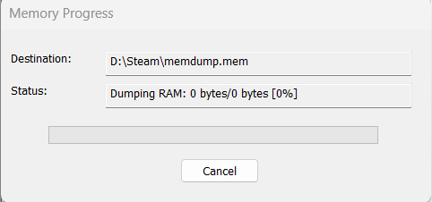
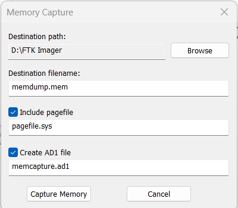
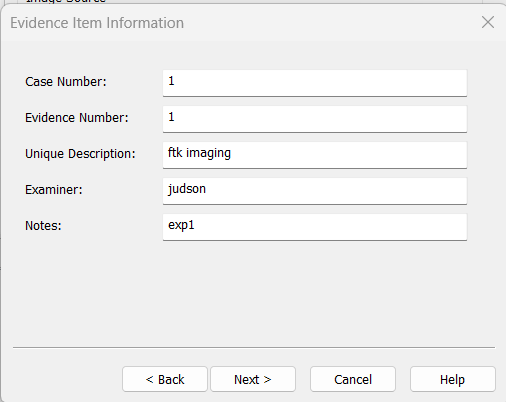
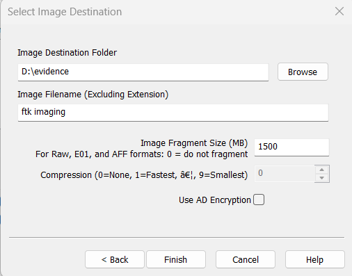
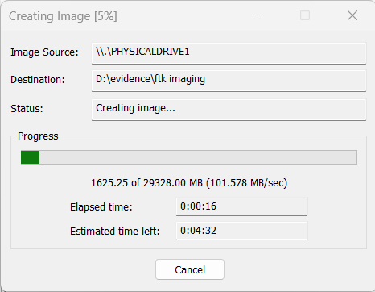
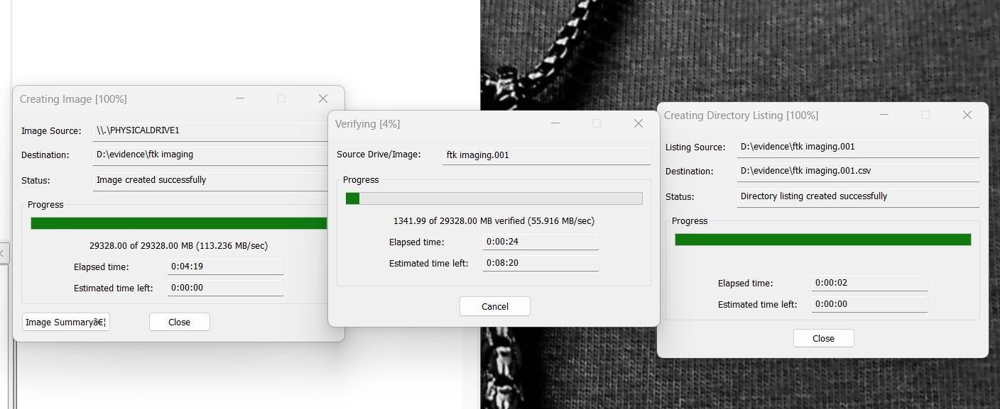
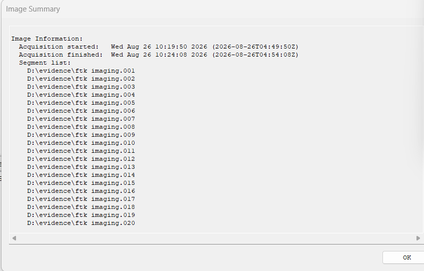
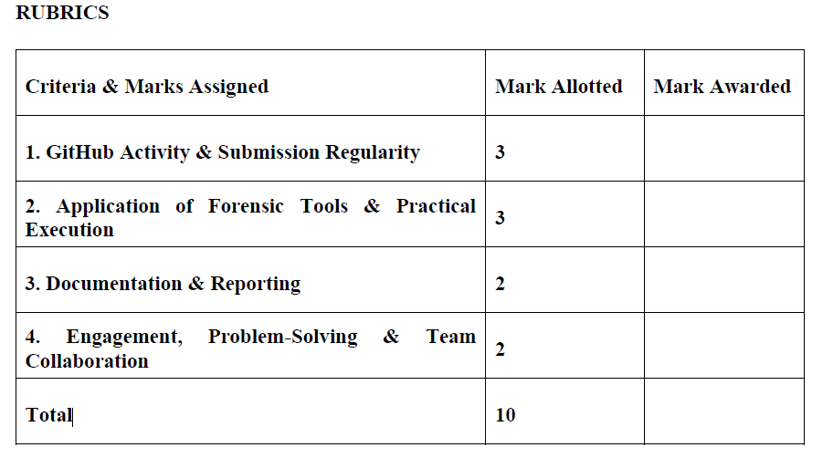

# Experiment 01: Evidence Acquisition Using AccessData FTK Imager, WinPmem & Volatility 3

[](#)
[](#)
[](#)

---

## 📌 Navigation
[🏠 Return to Master Syllabus](../README.md) | [Experiment 02: TestDisk Partition Recovery ➡️](../Experiment-2/README.md)

---

## 🎯 1. Aim
To perform a complete digital forensics acquisition and analysis lifecycle by:
1. Imaging non-volatile storage (physical/logical drives) using **AccessData FTK Imager**.
2. Capturing live volatile memory (RAM) using the **WinPmem** command-line utility.
3. Analyzing the extracted memory dump using the **Volatility 3** framework to recover active volatile artifacts (process lists, network sockets, injected code).

---

## 🛠️ 2. Software & Tools Required
| Tool / Utility | Version / Type | Purpose | Platform |
| :--- | :--- | :--- | :--- |
| **AccessData FTK Imager** | GUI Forensic Imager | Bit-stream disk imaging & hash verification | Windows |
| **WinPmem** | CLI Memory Acquisition Utility | Physical memory (RAM) dump capture | Windows |
| **Volatility 3** | Python3 Memory Forensics Framework | In-depth volatile memory artifact parsing | Cross-platform |
| **Hardware Write Blocker** | Physical / Software Write Blocker | Maintains evidence source disk integrity | Hardware / OS |

---

## 📖 3. Theoretical Background & Key Concepts

### 3.1 Volatile vs. Non-Volatile Memory
- **Volatile Memory (RAM):** Retains data only while powered. Contains live-state artifacts such as running processes, active network connections, open sockets, decrypted encryption keys, clipboard data, and injected in-memory malware. Subject to immediate loss upon system shutdown (Order of Volatility: RFC 3227).
- **Non-Volatile Memory (Secondary Storage):** Magnetic HDDs, Solid-State Drives (SSDs), and USB flash media. Retains persisted files, unallocated clusters, slack space, file system metadata (MFT, FAT), and deleted records.

### 3.2 Acquisition Methodologies
1. **Live Acquisition (Triage):** Executing portable forensic tools (e.g., FTK Imager Lite, WinPmem) from external write-protected media on a running machine. Minimizes volatile data loss while carefully documenting the investigator's system footprint.
2. **Dead / Static Acquisition:** Imaging powered-off media connected to an analysis workstation via a certified **hardware write blocker** (e.g., Tableau, CRU WiebeTech) to guarantee that zero write operations reach the evidence device.

### 3.3 Target Forensic Image Formats
| Format | Extension | Characteristics |
| :--- | :--- | :--- |
| **Raw / DD** | `.raw`, `.dd`, `.001` | Pure bit-for-bit stream without headers or metadata; universal tool interoperability. |
| **Expert Witness (E01)** | `.E01` | Guidance Software EnCase standard. Embeds acquisition metadata, timestamps, case notes, and segmented MD5/SHA1 hash checks with lossless compression. |
| **Advanced Forensic Format** | `.aff`, `.aff4` | Open-source extensible forensic container supporting multi-volume streaming and metadata. |
| **AccessData Custom** | `.ad1` | Specialized logical evidence container created by FTK Imager for targeted directories. |
| **SMART** | `.s01` | Linux bitstream format with section headers and CRC checks. |

---

## 🔬 4. Step-by-Step Procedure

### Phase 1: Volatile Memory (RAM) Acquisition via FTK Imager
1. Launch **AccessData FTK Imager** with administrative privileges (`Run as Administrator`).
2. Navigate to the top toolbar and click the **Capture Memory** icon (or select `File > Capture Memory`).
3. Configure the destination parameters:
   - **Destination path:** Specify a secure external volume.
   - **Destination filename:** `memdump.mem`.
   - **Include Pagefile:** Check `Include pagefile` to capture `pagefile.sys` (secondary swap containing valuable RAM overflow).
   - **Create AD1 file:** Optional logical container creation.
4. Click **Capture Memory** to begin streaming RAM to disk.


*Figure 1.1: FTK Imager Volatile Memory Capture configuration dialog.*

---

### Phase 2: Non-Volatile Disk Imaging via FTK Imager
1. In FTK Imager, click `File > Create Disk Image`.
2. Select the **Source Type**:
   - **Physical Drive:** Images the entire physical device including Partition Tables (MBR/GPT), volume slack, unpartitioned space, and unallocated clusters.
   - **Logical Drive:** Images a specific mapped partition or mounted volume.
   - **Image File / Contents of a Folder:** Converts or packages existing targets.


*Figure 1.2: Selecting the evidence source type (Physical Drive).*

3. Select the target physical device (e.g., USB Drive `\\.\PHYSICALDRIVE1`) and proceed.
4. In the **Create Image** dialog, click **Add...** under *Image Destination*.
5. Select the forensic format (e.g., **Raw (dd)** or **E01**).
6. Fill in the **Evidence Item Information**:
   - **Case Number:** `DF-2024-EX01`
   - **Evidence Number:** `EV-01`
   - **Unique Description:** Physical USB Drive Evidence Acquisition
   - **Examiner:** Lead Forensic Analyst
   - **Notes:** Baseline acquisition under laboratory protocol


*Figure 1.3: Documenting chain of custody and case metadata.*

7. Set the **Image Destination Folder**, **Image Filename** (`usb_evidence`), and set **Image Fragment Size** to `0` (creates a single monolithic image file instead of split chunks).
8. Enable **Verify images after they are created** to initiate post-acquisition cryptographic hash verification.


*Figure 1.4: Configuring destination path, single-file fragment size (0 MB), and automated verification.*

9. Click **Start** to initiate acquisition.


*Figure 1.5: Real-time acquisition status, write speed, and block processing.*

---

### Phase 3: Live Volatile Memory Capture using WinPmem CLI
As a cross-verification CLI method for live memory preservation:
1. Open an elevated Command Prompt (`cmd.exe` as Administrator).
2. Execute the WinPmem executable to extract physical RAM into a raw binary container:
```cmd
winpmem.exe -o memdump.raw
```


*Figure 1.6: Capturing full physical RAM using the WinPmem driver from elevated terminal.*

---

### Phase 4: Cryptographic Verification & Hash Matching
1. Once FTK Imager completes disk imaging, the automated verification engine reads back the created image file bit-by-bit.
2. The computed MD5 and SHA-1 hashes of the generated image are matched against the hardware source disk.
3. Verified matching hashes certify that **zero bytes were modified** and the evidence image is a bit-stream replica.


*Figure 1.7: FTK Imager Image Verification Results confirming exact MD5 and SHA-1 checksum matches.*

---

### Phase 5: Memory Analysis using Volatility 3
1. With the memory dump acquired (`memdump.raw`), execute Volatility 3 plugins to analyze volatile artifacts:
```bash
# List active processes and thread structures
python vol.py -f memdump.raw windows.pslist

# Scan for hidden/unlinked processes (DKOM detection)
python vol.py -f memdump.raw windows.psscan

# Inspect network sockets and active TCP/UDP connections
python vol.py -f memdump.raw windows.netscan
```


*Figure 1.8: Volatility 3 CLI recovering running processes, PIDs, and parent-child lineages from the raw RAM dump.*

---

## 📊 5. Observations & Forensic Findings
1. **Disk Image Integrity:** The physical drive acquisition generated an exact 1:1 bitstream replica. Post-imaging verification yielded matching MD5 and SHA-1 checksums, validating the non-destructive nature of the acquisition.
2. **Volatile Artifact Recovery:** Both FTK Imager and WinPmem successfully dumped the physical address space into `.mem` and `.raw` containers without memory manager crashes.
3. **In-Memory Triage:** Volatility 3 successfully identified the operating system kernel symbols, active process trees (`Explorer.EXE`, `svchost.exe`, browser instances), and network sockets active at the precise moment of capture.

---

## 🏆 6. Result
A complete digital forensics acquisition and analysis workflow was successfully executed via a combination of GUI and CLI tools. The target physical storage drive was securely imaged and cryptographically verified using **AccessData FTK Imager**. Simultaneously, live system RAM was extracted via the Windows command prompt using **WinPmem**, and **Volatility 3** command-line syntax was utilized to parse the raw memory file, successfully recovering critical live-state artifacts.
