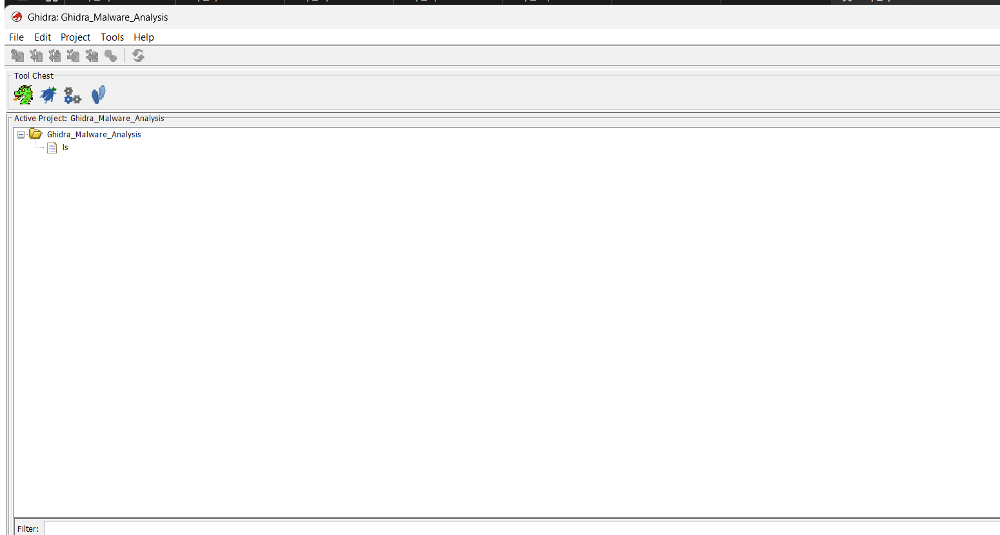
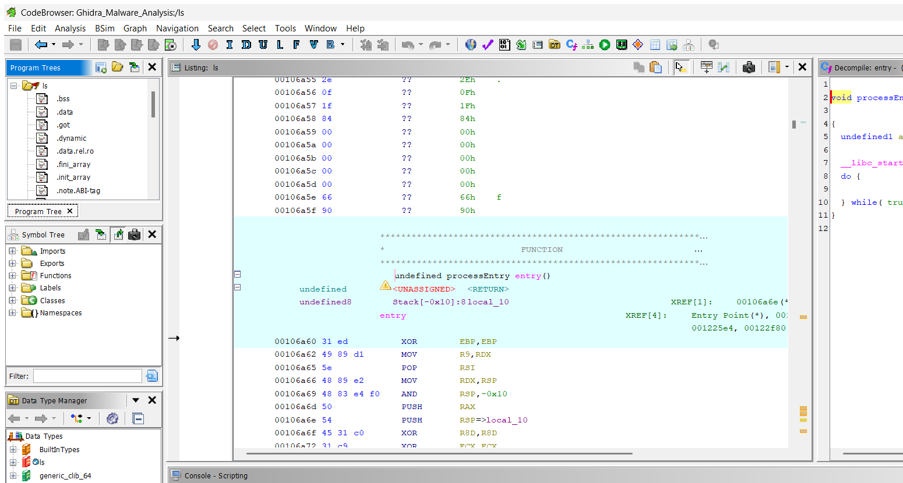
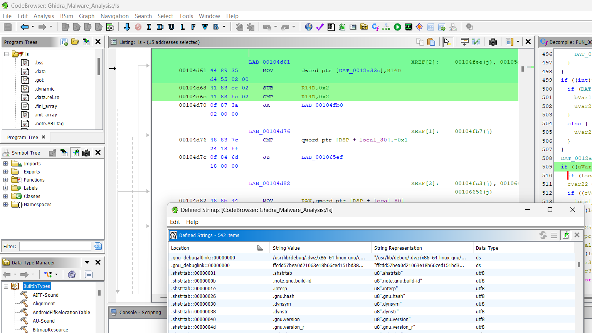
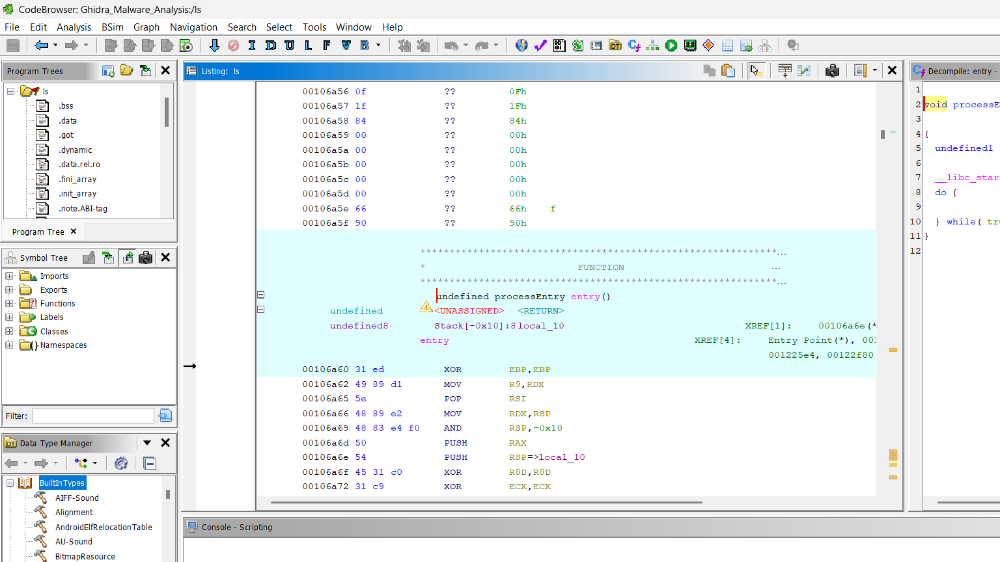
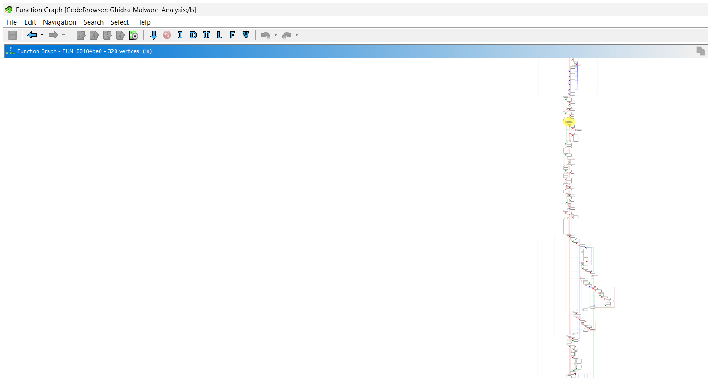

# Experiment 10: Binary Disassembly, Function Decompilation & Static Code Analysis Using Ghidra

---

## 📌 Navigation
[⬅️ Experiment 09: Process Explorer](../Experiment-9/README.md) | [🏠 Master Syllabus](../README.md)

---

## 🎯 1. Aim
To configure a secure reverse engineering environment, utilize the **Ghidra Software Reverse Engineering (SRE)** framework to disassemble and decompile compiled binary code, analyze low-level assembly functions, trace execution control flow, resolve stripped symbols, and identify indicators of compromise (IoCs) and behavioral logic.

---

## 🛠️ 2. Software & Tools Required
| Component | Specification | Purpose |
| :--- | :--- | :--- |
| **Operating System** | Isolated VM (Linux / Windows) | Secure malware/binary analysis sandbox |
| **Forensics Tool** | Ghidra (NSA Open Source SRE Framework) | Multi-architecture disassembler and decompiler |
| **Runtime Environment**| OpenJDK 21 (Java Development Kit) | Required runtime for Ghidra engine |
| **Target Binary** | Controlled ELF 64-bit binary (`/bin/ls`) | Target executable for static reverse engineering |

---

## 📖 3. Theoretical Background & Key Concepts

### 3.1 Static Analysis vs. Dynamic Analysis
- **Dynamic Analysis:** Executing a suspect binary inside an instrumented sandbox while monitoring process behavior, API hooks, registry changes, and network traffic.
- **Static Analysis:** Dissecting compiled binaries without executing them. Prevents anti-analysis detonation and malware propagation while uncovering hidden dormant logic.

### 3.2 Ghidra Architecture & Analysis Capabilities
Ghidra (developed by the National Security Agency) incorporates advanced reverse engineering modules:
1. **CodeBrowser:** Central workbench featuring synchronized Disassembly (Listing) and Decompiler panes.
2. **Decompiler:** Algorithmically transforms x86/x64 assembly instructions into human-readable C-like pseudocode, reconstructing variable types, parameters, and control structures.
3. **Symbol Tree:** Indexes imported shared libraries (`.so`, DLLs), exported symbols, and internal functions.
4. **Function Graph (CFG):** Visualizes Control Flow Graphs where basic blocks of assembly instructions are represented as interactive nodes connected by conditional branch vectors.
5. **Stripped Symbol Recovery:** In production Linux binaries, debugging symbol tables (`.symtab`) are frequently stripped (`strip -s`). Analysts must locate the entry vector (`processEntry`) and inspect the arguments passed to `__libc_start_main` to locate the true `main()` function.

---

## 🔬 4. Step-by-Step Procedure

### Step 1: Environment Initialization & Binary Import
1. Ensure Java OpenJDK 21 and Ghidra are installed.
2. Launch Ghidra by running `ghidraRun` (Linux/macOS) or `ghidraRun.bat` (Windows).
3. Create a new non-shared project titled `Ghidra_Malware_Analysis`.
4. Click `File > Import File`, select the target binary (`/bin/ls`), and confirm format parameters (ELF 64-bit x86-64 executable).

*Figure 1: Initial Ghidra Project Window showing newly imported target binary.*

5. Double-click the imported binary to open it in **CodeBrowser**.
6. When prompted, select **Yes** to initiate automated analysis (Auto-Analyze) with default analyzers enabled.

*Figure 2: Ghidra CodeBrowser interface displaying disassembly listing and decompiler after Auto-Analysis.*

---

### Step 2: String Extraction & Shared Library Import Analysis
1. Navigate to `Window > Defined Strings` to extract hardcoded ASCII and Unicode strings. (In malware analysis, this reveals C2 domains, dropped filenames, and encryption keys).
2. In the left-hand **Symbol Tree** pane, expand **Imports** to evaluate dynamic shared libraries (`libc.so.6`) and API calls (`fork`, `execve`, `socket`, `ptrace`).

*Figure 3: Extraction of defined strings and identification of system library imports.*

---

### Step 3: Function Decompilation
1. In the **Symbol Tree**, expand **Functions**.
2. Select the `entry` function (`processEntry` at virtual address `00106a60`).
3. In the center Listing window, inspect raw assembly mnemonics (`push`, `mov`, `call`).
4. In the right-hand **Decompile** pane, observe the decompiled C-like pseudocode reconstructing the invocation of `__libc_start_main`.

*Figure 4: Decompiled C pseudocode of entry function revealing pointer to main routine.*

---

### Step 4: Stripped Binary Analysis & Main Function Identification
1. Because the binary's symbol table was stripped, `main()` is represented as an unlabeled address (`FUN_00104be0`).
2. Identify `FUN_00104be0` as the first argument passed into `__libc_start_main`.
3. Double-click `FUN_00104be0` to navigate into the core program logic.

---

### Step 5: Visualizing Execution Flow via Function Graph
1. With `FUN_00104be0` active, navigate to `Window > Function Graph` (or press `Ctrl + Space`).
2. Analyze the interactive Control Flow Graph (CFG):
   - 🟩 **Green Arrows:** True / taken conditional branches.
   - 🟥 **Red Arrows:** False / fall-through branches.
   - 🟦 **Blue Lines:** Unconditional jumps and loops.
3. Trace decision structures and critical execution paths through the function's 320+ mapped vertices.

*Figure 5: Interactive Function Graph illustrating complex execution paths and branch logic.*

---

## 📊 5. Observations & Forensic Findings
- **Disassembly Accuracy:** Ghidra parsed the ELF header, program headers, and sections (`.text`, `.data`, `.rodata`, `.bss`, `.got`, `.plt`) with high fidelity.
- **Decompiler Performance:** The decompiler reconstructed complex assembly loops and stack parameters into maintainable C pseudo-syntax.
- **Symbol Resolution:** Despite the absence of `.symtab`, tracing the initialization stub into `__libc_start_main` successfully located the true application entry point.

---

## 📝 6. Academic Assessment Rubrics
| Criteria & Marks Assigned | Mark Allotted | Mark Awarded |
| :--- | :---: | :---: |
| 1. GitHub Activity & Submission Regularity | 3 | -- |
| 2. Application of Forensic Tools & Practical Execution | 3 | -- |
| 3. Documentation & Reporting | 2 | -- |
| 4. Engagement, Problem-Solving & Team Collaboration | 2 | -- |
| **Total** | **10** | -- |

---

## 🏆 7. Result
The **Ghidra** reverse engineering framework was successfully utilized to disassemble, decompile, and analyze compiled binary code. Automated analysis, string inspection, API import tracking, and control flow graphing allowed the program's underlying architecture, behavioral mechanisms, and execution pathways to be comprehensively interpreted.
