# Experiment 02: Partition Recovery and Deleted File Carving Using TestDisk

---

## 📌 Navigation
[⬅️ Experiment 01: Evidence Acquisition](../Experiment-1/README.md) | [🏠 Master Syllabus](../README.md) | [Experiment 03: Wireshark Analysis ➡️](../Experiment-3/README.md)

---

## 🎯 1. Aim
To recover deleted files, rebuild missing or corrupted partition tables, and repair damaged file system boot sectors (FAT/NTFS/ext) from physical storage media using the **TestDisk** open-source data recovery utility.

---

## 🛠️ 2. Software & Tools Required
| Tool / Utility | Version / Type | Purpose | Platform |
| :--- | :--- | :--- | :--- |
| **TestDisk** | v7.x (CLI / Curses) | Low-level disk geometry analysis, partition recovery, and MFT/boot sector repair | Windows / Linux / macOS |
| **Storage Device** | Physical / Disk Image | Storage device exhibiting missing partitions and carved/deleted files | Block Device |

---

## 📖 3. Theoretical Background & Key Concepts

### 3.1 Partition Tables & Boot Sectors
- **Partition Table (MBR / GPT):** The Master Boot Record (MBR) located at Sector 0 contains a 64-byte partition table indexing up to four primary partitions. GPT (GUID Partition Table) provides redundancy with primary and backup partition tables across the drive. If partition table entries are corrupted, overwritten by malware, or deleted by users, the operating system treats the disk as unallocated or raw.
- **Boot Sector (VBR):** The Volume Boot Record resides at the first sector of each partition (e.g., Sector 0 of the partition). It holds critical BIOS Parameter Block (BPB) metadata (sector size, cluster size, MFT cluster pointer). NTFS and FAT file systems maintain a **backup boot sector** at the end of the partition volume.

### 3.2 TestDisk Forensic Capabilities
1. **Partition Table Restoration:** Scans sector boundaries for recognizable file system superblocks, backup boot sectors, and MFT mirrors to reconstruct deleted partition boundaries.
2. **Boot Sector Repair:** Restores damaged primary boot sectors by copying verified backup boot sectors.
3. **MFT & FAT Table Synchronization:** Repairs Master File Table mirror mismatches.
4. **Undelete & File Carving:** Traverses unallocated cluster records to display deleted file entries in red text and copy them to safe target destinations.

---

## 🔬 4. Step-by-Step Procedure

### Step 1: Log File Creation
1. Launch `testdisk_win.exe` with administrative rights.
2. Select `[ Create ]` to initialize a new session log (`testdisk.log`) that records sector geometry and recovery operations for chain-of-custody documentation.

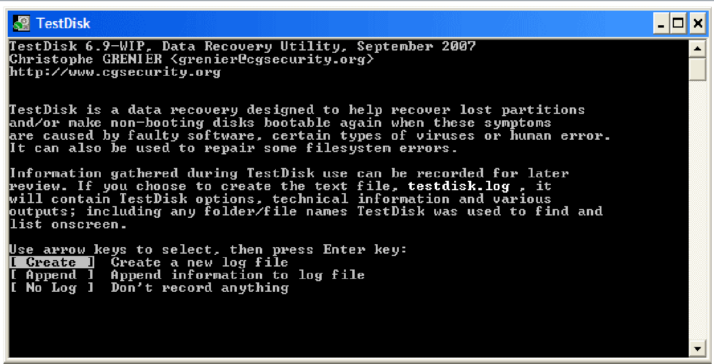
*Figure 2.1: TestDisk log creation prompt ([Create] selected).*

---

### Step 2: Storage Media Selection
1. TestDisk scans all connected storage controllers and displays physical drives with their detected capacities.
2. Select the target physical disk (e.g., `/dev/sda` or `Drive C:`) using the arrow keys and press **Enter** to proceed.

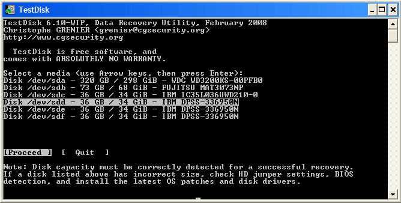
*Figure 2.2: Selecting the target drive for forensic recovery.*

---

### Step 3: Partition Table Type Selection
1. TestDisk automatically identifies and highlights the default partition architecture:
   - **Intel:** Intel/PC partition (MBR)
   - **EFI GPT:** GUID Partition Table (modern UEFI systems)
   - **Mac / Sun / Xbox:** Specialized platforms
2. Confirm the auto-detected partition type by pressing **Enter**.

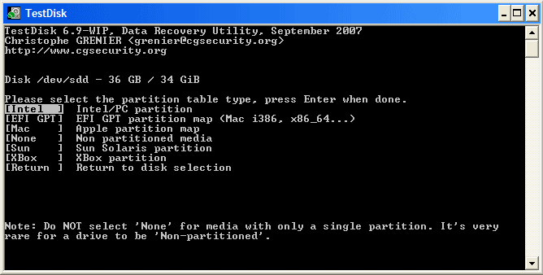
*Figure 2.3: Partition table architecture detection.*

---

### Step 4: Partition Analysis & Structure Examination
1. Select the `[ Analyse ]` menu item to inspect current partition structures and identify lost partitions.
2. Review the displayed layout:
   - Overlapping partitions or partitions listed twice indicate table corruption.
   - An *Invalid NTFS Boot* flag denotes a damaged volume boot sector.

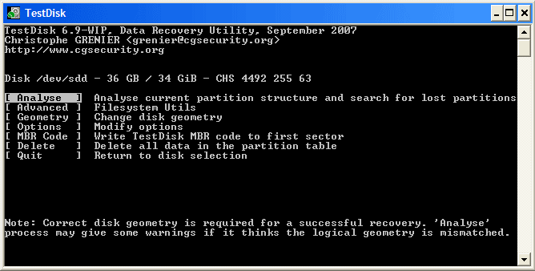
*Figure 2.4: Analyzing current partition layout.*

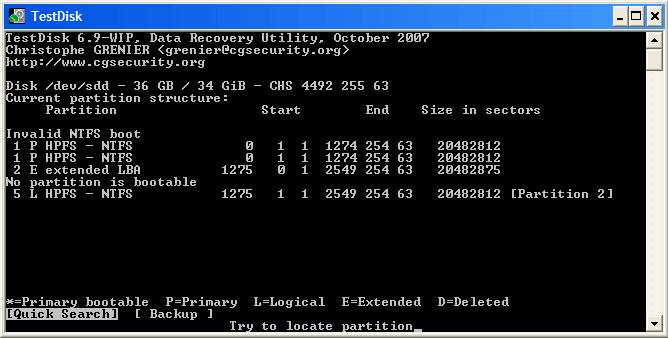
*Figure 2.5: Inspecting partition entries and corrupted boot sector flags.*

---

### Step 5: Quick Search for Missing Partitions
1. Select `[ Quick Search ]` to scan common sector offsets for file system headers.
2. TestDisk displays discovered partitions in real-time.
3. Highlight a detected partition and press **`P`** to list files and directories:
   - Existing active files appear in normal font.
   - **Deleted files appear in red font.**
4. Press **`Q`** to return to the partition menu.

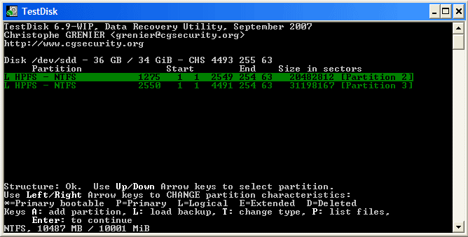
*Figure 2.6: Quick Search discovering missing logical volumes.*

---

### Step 6: Deeper Search & Backup Boot Sector Inspection
1. If initial volumes remain missing or corrupt, select `[ Deeper Search ]`.
2. Deeper Search traverses every cylinder/sector, scanning for backup boot sectors (FAT32/NTFS) and ext2/3/4 superblocks.
3. When NTFS is identified via its backup sector, TestDisk displays `"NTFS found using backup sector!"`.

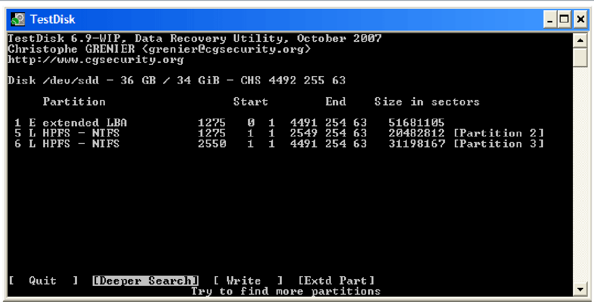
*Figure 2.7: Initiating deep sector-by-sector scan.*

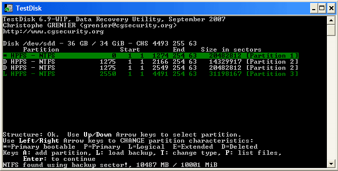
*Figure 2.8: Partitions recovered using backup boot sectors.*

---

### Step 7: Verifying File Hierarchy & Setting Partition Flags
1. Highlight the valid recovered partition and press **`P`** to browse directory contents.
2. Verify directory trees and file integrity.
3. Change partition status flags using left/right arrow keys:
   - `*` = Primary Bootable
   - `P` = Primary
   - `L` = Logical
   - `D` = Deleted

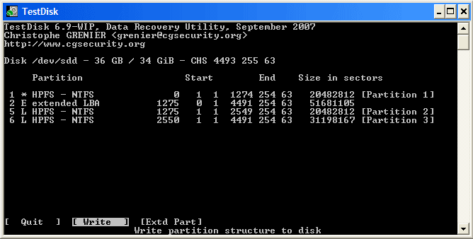
*Figure 2.9: Browsing files and verifying directory permissions.*

---

### Step 8: Writing Recovered Partition Table
1. Once all required partitions are correctly mapped, navigate to `[ Write ]`.
2. Confirm the write operation with **`Y`** to commit the reconstructed partition table to Sector 0.

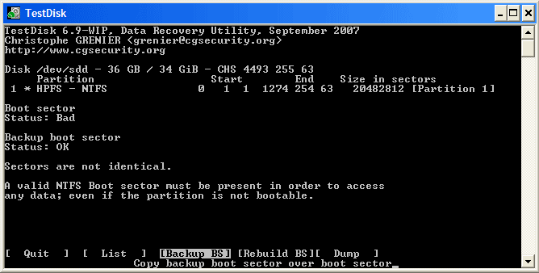
*Figure 2.10: Writing the restored partition table to disk.*

---

### Step 9: NTFS Boot Sector Recovery & Synchronization
1. Under `[ Advanced ] > [ Boot ]`, inspect the status of the primary boot sector versus backup boot sector.
2. When the primary is *Bad* and backup is *Valid*, select `[ Backup BS ]` to copy the healthy backup over the corrupted primary boot sector.
3. Confirm that both sectors report `Both OK and identical`.

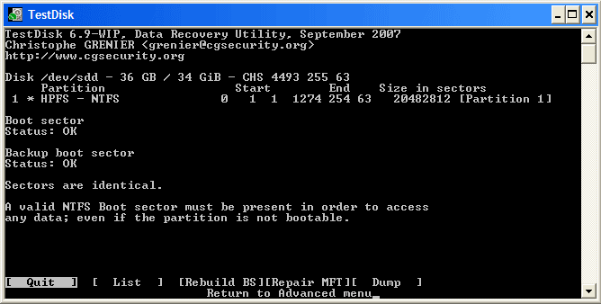
*Figure 2.11: Copying valid backup boot sector to restore primary boot sector.*

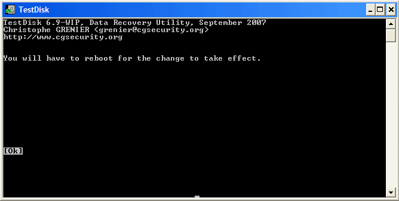
*Figure 2.12: Primary and backup boot sectors verified identical.*

---

### Step 10: Completion & System Reboot
1. Exit TestDisk and reboot the system to allow the OS kernel to re-read the updated partition table.

*Figure 2.13: TestDisk prompting system restart to mount recovered file systems.*

---

## 📊 5. Observations & Forensic Findings
1. **Geometry Mapping:** TestDisk accurately interpreted disk geometry (Heads/Sectors/Cylinders), identifying deleted logical partitions located within an extended container.
2. **File Recovery:** Pressing `P` enabled complete file system traversal. Critical deleted files marked in red were extracted non-destructively to an external forensic staging folder.
3. **Boot Sector Integrity:** Mismatched boot sector signatures were resolved through backup superblock synchronization without requiring external formatting tools.

---

## 🏆 6. Result
The **TestDisk** data recovery utility was successfully executed to analyze the physical drive's geometry and partition tables. Lost partitions were successfully identified through deeper searching, damaged boot sectors were repaired using backup superblocks, and deleted files were effectively navigated, selected, and carved to a secure destination.
