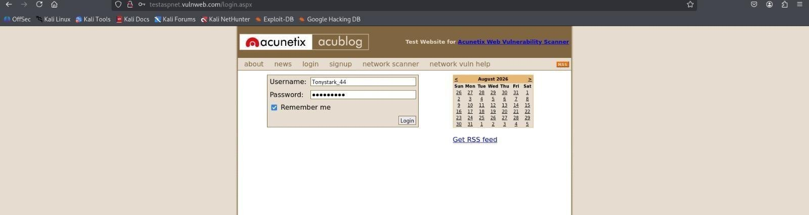
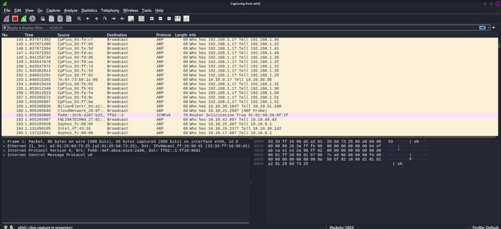
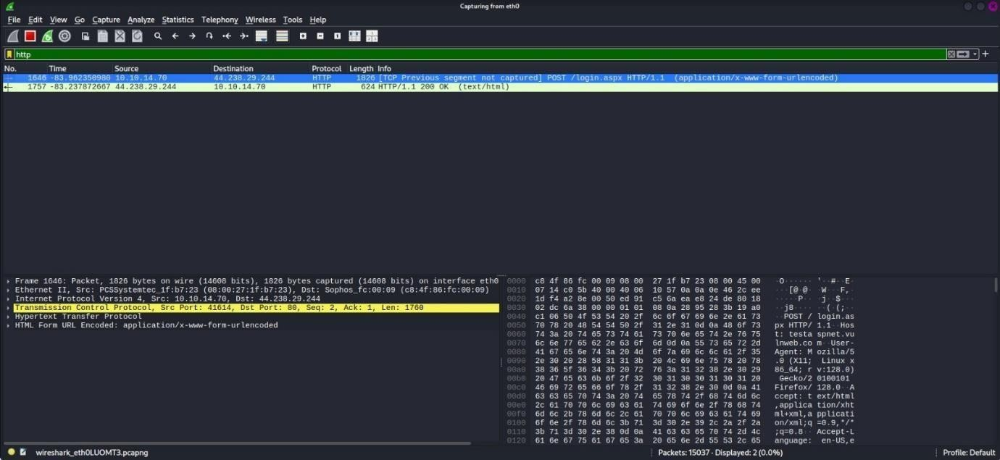
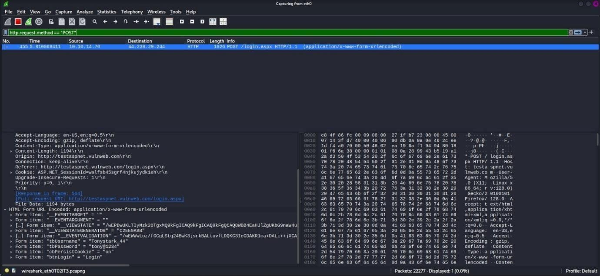

# Experiment 03: Password Capturing and Traffic Analysis Using Wireshark

[](#)
[](#)
[](#)

---

## 📌 Navigation
[⬅️ Experiment 02: TestDisk Partition Recovery](../Experiment-2/README.md) | [🏠 Master Syllabus](../README.md) | [Experiment 04: Mail Header Analysis ➡️](../Experiment-4/README.md)

---

## 🎯 1. Aim
To capture and analyze unencrypted network traffic using the **Wireshark** packet analyzer, isolate HTTP `GET` and `POST` request methods, and extract transmitted plain-text authentication credentials (username and password).

---

## 🛠️ 2. Software & Tools Required
| Tool / Utility | Version / Type | Purpose | Platform |
| :--- | :--- | :--- | :--- |
| **Wireshark** | v4.x (GUI Packet Analyzer) | Live packet sniffing, protocol decoding, and display filter queries | Windows / Linux / macOS |
| **Target Web App** | HTTP Login Application | Unencrypted HTTP form authentication endpoint | Web / Localhost |
| **Web Browser** | Chrome / Firefox / Edge | Client generating HTTP web traffic | Any |

---

## 📖 3. Theoretical Background & Key Concepts

### 3.1 Network Packet Sniffing & Promiscuous Mode
Packet sniffing intercepts data packets traversing a computer network. When a network interface card (NIC) operates in **promiscuous mode**, it passes all received frames to the operating system protocol stack regardless of destination MAC address. Wireshark leverages the `Npcap` (Windows) or `libpcap` (Linux) packet capture library to capture raw layer 2 through layer 7 traffic.

### 3.2 HTTP vs. HTTPS Vulnerabilities
- **HTTP (Hypertext Transfer Protocol - Port 80):** Transmits data in cleartext without encryption. Authentication forms, session tokens, cookies, and sensitive payloads are visible to any node or intermediary analyst on the local broadcast domain.
- **HTTPS (HTTP Secure - Port 443):** Wraps HTTP traffic within Transport Layer Security (TLS/SSL), encrypting the application payload.
- **HTTP Methods:**
  - `GET`: Appends query parameters directly to the URL string. Typically used for retrieving server resources.
  - `POST`: Encapsulates form parameters inside the HTTP request body (`application/x-www-form-urlencoded` or `multipart/form-data`). While concealed from the URL bar, data remains completely unencrypted over standard HTTP.

---

## 🔬 4. Step-by-Step Procedure

### Step 1: Capture Initialization
1. Launch Wireshark with appropriate capture privileges.
2. Select the active network interface generating traffic (e.g., *Wi-Fi* or *Ethernet*).
3. Double-click the interface to initiate live packet capture.

---

### Step 2: Triggering Target Authentication Request
1. Open a web browser and navigate to the target unencrypted HTTP test application.
2. Enter credentials into the login form:
   - **Username:** `Tonystark_44`
   - **Password:** `tony@1234`
3. Click the login button to transmit the HTTP authentication request.


*Figure 3.1: Submitting plain-text credentials on target HTTP test form.*

---

### Step 3: Filtering Captured Traffic for HTTP Protocol
1. Return to Wireshark and stop the packet capture.
2. In the display filter bar, enter the protocol filter:
```text
http
```
3. Press **Enter** to isolate all Hypertext Transfer Protocol packets from DNS, TCP handshakes, and background broadcast noise.


*Figure 3.2: Filtering captured packet stream using the 'http' display filter.*

---

### Step 4: Investigating HTTP GET Requests
1. Apply the method-specific filter:
```text
http.request.method == "GET"
```
2. Observe the captured GET packets: they retrieve static assets (HTML pages, stylesheets, images) but contain no authentication body payloads.


*Figure 3.3: Analyzing HTTP GET requests.*

---

### Step 5: Isolating HTTP POST Requests & Form Extraction
1. Apply the POST method filter:
```text
http.request.method == "POST"
```
2. Identify the packet where the login endpoint received client form parameters.
3. In the packet list pane, select the POST transaction.
4. Expand the **HTML Form URL Encoded** layer in the packet details pane.


*Figure 3.4: Isolating the HTTP POST packet containing user form submission.*

---

### Step 6: Decoded Credential Artifacts
Under `HTML Form URL Encoded`:
- **Form item:** `"uname" = "Tonystark_44"`
- **Form item:** `"pass" = "tony@1234"`


*Figure 3.5: Extracted credentials displayed directly in Wireshark packet details pane.*

---

## 📊 5. Observations & Forensic Findings
| Field / Parameter | Extracted Forensic Value | Protocol Layer |
| :--- | :--- | :--- |
| **Transmission Protocol** | HTTP / 1.1 | Application Layer |
| **Request Method** | POST | Application Layer |
| **Target URL / Host** | Target Web Application | Application Layer |
| **Content-Type** | `application/x-www-form-urlencoded` | Header |
| **Extracted Username** | `Tonystark_44` | Form Data Body |
| **Extracted Password** | `tony@1234` | Form Data Body |

---

## 🏆 6. Result
Network traffic was successfully captured and analyzed using **Wireshark**. Plain-text authentication credentials (**Username:** `Tonystark_44`, **Password:** `tony@1234`) transmitted over cleartext HTTP were successfully isolated and extracted from the application POST request payload.
