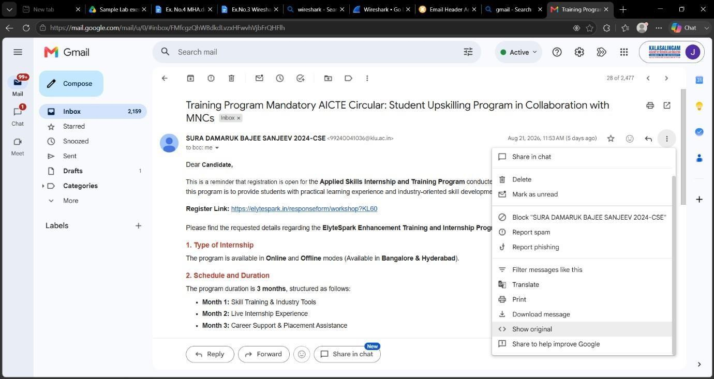
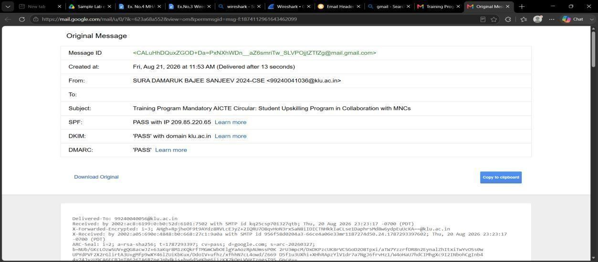
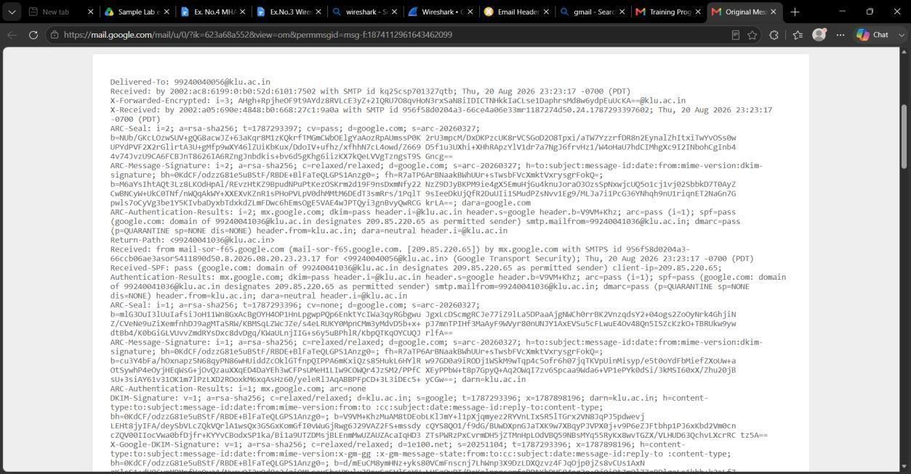
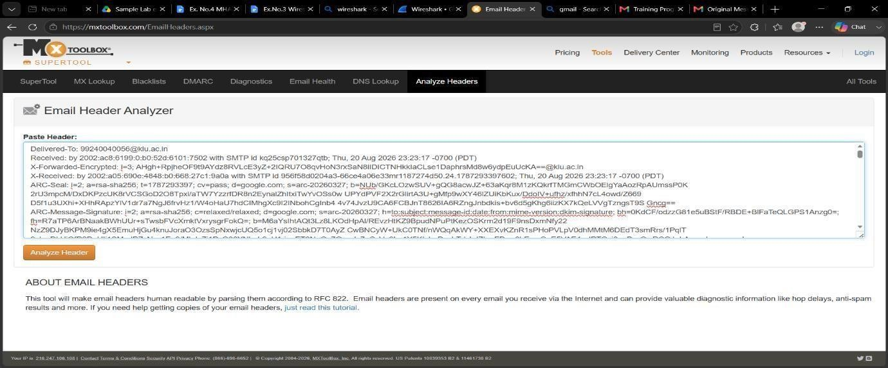
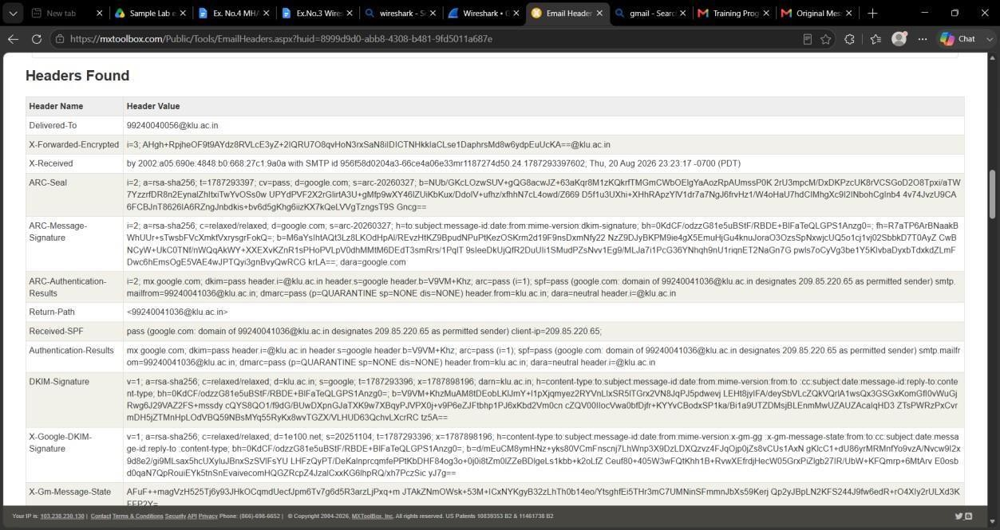
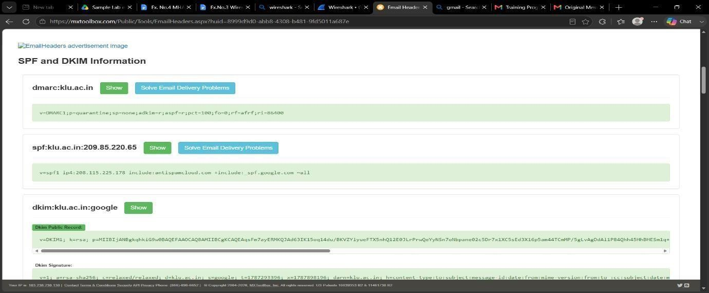

# Experiment 04: Email Header Analysis and Spoofing Detection Using MHA & MXToolbox

---

## 📌 Navigation
[⬅️ Experiment 03: Wireshark Analysis](../Experiment-3/README.md) | [🏠 Master Syllabus](../README.md) | [Experiment 05: Autopsy Case Management ➡️](../Experiment-5/README.md)

---

## 🎯 1. Aim
To extract and analyze Internet email headers, trace message transit routes through intermediate Mail Transfer Agents (MTAs), and detect email spoofing and phishing attempts by evaluating **SPF**, **DKIM**, and **DMARC** authentication records using **Mail Header Analyzer (MHA)** and **MXToolbox**.

---

## 🛠️ 2. Software & Tools Required
| Tool / Utility | Version / Type | Purpose | Platform |
| :--- | :--- | :--- | :--- |
| **Mail Header Analyzer (MHA)** | Web / Plugin Utility | Automated RFC 822/5322 header parsing and hop delay visualization | Web / Office 365 |
| **MXToolbox Email Analyzer** | Web Security Suite | SPF/DKIM/DMARC verification and IP blacklist cross-referencing | Web |
| **Webmail Client** | Gmail / Outlook / Yahoo | Raw internet message header extraction | Browser |

---

## 📖 3. Theoretical Background & Key Concepts

### 3.1 Internet Message Headers (RFC 5322)
Email messages consist of two components: the **Body** (message content) and the **Header** (structured metadata documenting transmission history). While user agents display simplified fields (`From:`, `Subject:`, `Date:`), the underlying header maintains the authentic forensic record.
- `From:` Claimed sender display address (easily spoofed in SMTP).
- `Return-Path:` Bounce address where Non-Delivery Reports (NDRs) are routed.
- `Received:` Recorded by each intermediate MTA. **Headers are stacked in reverse chronological order:** the lowest `Received:` line represents the originating client/server, while the top represents the recipient's mail gateway.
- `Message-ID:` Globally unique identifier generated by the originating mail system.

### 3.2 Email Authentication Protocols
1. **SPF (Sender Policy Framework):** A DNS TXT record defining which IP addresses are authorized to send email on behalf of a given domain.
   - `Pass`: Originating IP matches authorized server list.
   - `SoftFail / Fail`: Originating IP unauthorized; indicates potential spoofing.
2. **DKIM (DomainKeys Identified Mail):** Uses asymmetric cryptography to digitally sign message headers and body. The sender signs with their private key, and the recipient verifies via public key retrieved from DNS.
   - `Pass`: Signature matches; message content was not altered in transit.
   - `Fail`: Signature invalid; tampering detected.
3. **DMARC (Domain-based Message Authentication, Reporting, and Conformance):** Enforces policy alignment between the `From:` header domain and SPF/DKIM validation results (`none`, `quarantine`, `reject`).

---

## 🔬 4. Step-by-Step Procedure

### Step 1: Extracting Raw Email Headers from Webmail
1. **Gmail:** Open target email > click the three vertical dots (`More`) in the upper-right corner > select **Show original**.
2. **Microsoft Outlook:** Open email > click `File > Properties` > locate the **Internet headers** text area.
3. **Yahoo Mail:** Open email > click `More` > select **View raw message**.

*Figure 4.1: Identifying suspicious email and selecting 'Show original'.*

---

### Step 2: Locating Message-ID & Transit Parameters
1. In the raw original view, locate the critical baseline fields:
   - `Message-ID: <CA+7eu=4pSeXgQ@mail.example.com>`
   - `Date:` Delivery timestamp
   - Authentication summary (SPF, DKIM, DMARC statuses)

*Figure 4.2: Identifying unique Message-ID and delivery parameters.*

2. Copy the entire raw header block to the clipboard.

*Figure 4.3: Selecting and copying the full RFC 5322 header text.*

---

### Step 3: Automated Header Parsing in Mail Header Analyzer
1. Open **MXToolbox Email Header Analyzer** or Microsoft **MHA**.
2. Paste the copied header block into the analysis input window and click **Analyze Header**.

*Figure 4.4: Submitting raw headers into MXToolbox Header Analyzer.*

---

### Step 4: Analyzing Hop Latencies and Received Chains
1. Examine the parsed hop table:
   - Hops are ordered chronologically from origin (Hop 1) to final delivery.
   - Latencies (delays between servers) are calculated. Abnormal delays indicate greylisting or suspicious routing proxies.

*Figure 4.5: Visualizing intermediate mail servers, relay IPs, and transit delay intervals.*

---

### Step 5: Evaluating SPF, DKIM & DMARC Security Alignment
1. Inspect the cryptographic verification results:
   - Verify the `SPF: PASS` or `FAIL` indicator against the sending IP.
   - Verify `DKIM: PASS` verifying domain signature consistency.
   - Check `DMARC: PASS` confirming alignment between header `From:` and SPF/DKIM domains.

*Figure 4.6: Analyzing SPF authorization and DKIM cryptographic signature status.*

*Figure 4.7: Summary validation report showing sender origin, IP geolocation, and security compliance.*

---

## 📊 5. Observations & Forensic Findings
| Field / Header | Extracted Value | Forensic Assessment |
| :--- | :--- | :--- |
| **Originating IP** | Recorded in lowest `Received` line | Verified against WHOIS and sender domain DNS |
| **Message-ID Domain** | Matches sending infrastructure | Domain alignment confirmed |
| **SPF Check** | `Pass` (`smtp.mailfrom` authorized) | Origin server authorized to send for domain |
| **DKIM Check** | `Pass` (Valid digital signature) | Body payload integrity maintained in transit |
| **DMARC Compliance** | `Pass` | Aligned policy prevents domain spoofing |

---

## 🏆 6. Result
The email header was successfully extracted and analyzed using **Mail Header Analyzer (MHA)** and **MXToolbox**. Authentication protocols (**SPF**, **DKIM**, **DMARC**) and intermediate MTA transit paths were thoroughly evaluated, demonstrating how to trace email origins, verify message authenticity, and detect spoofing and phishing threats.
