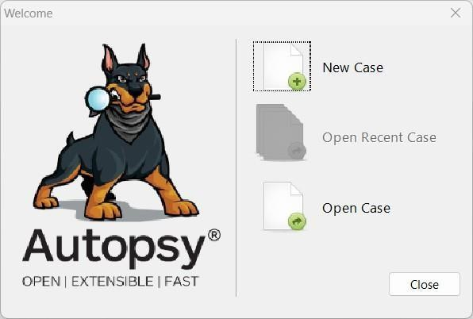
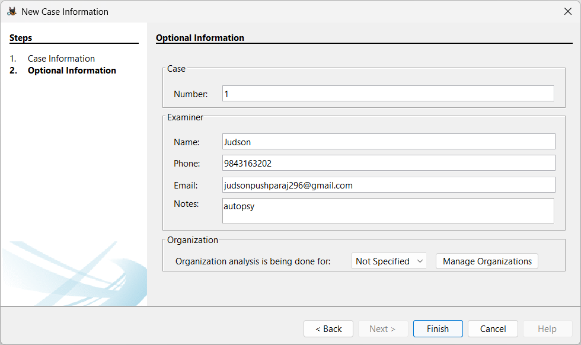
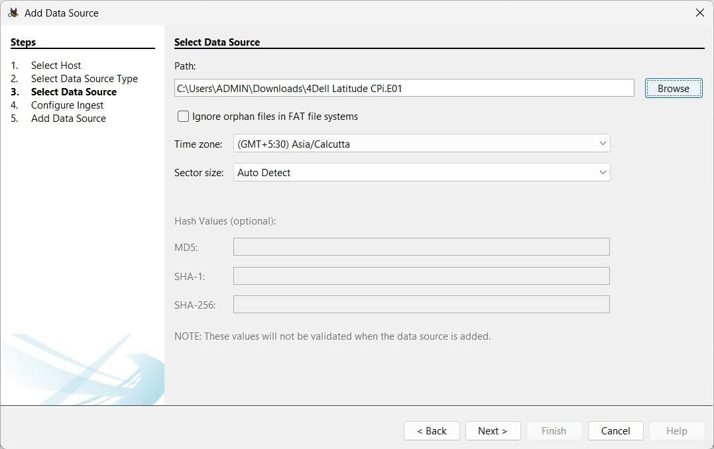
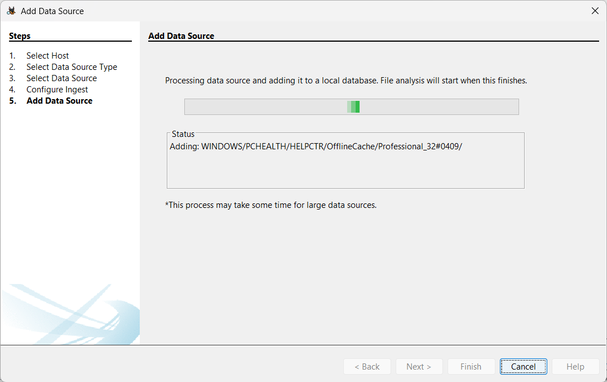
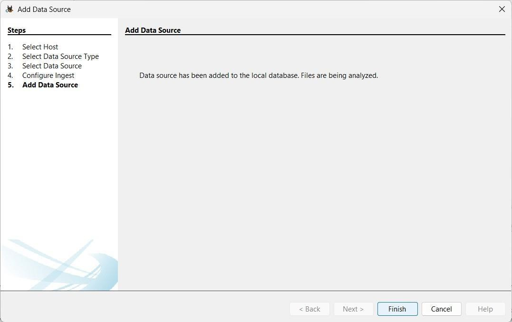
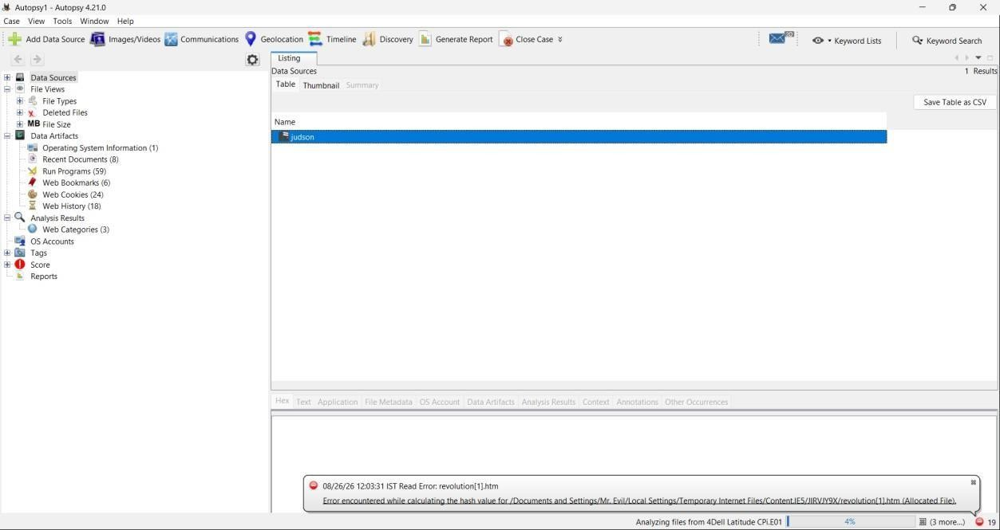
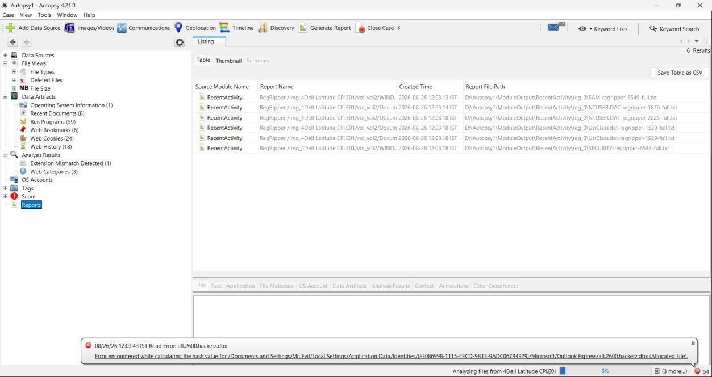
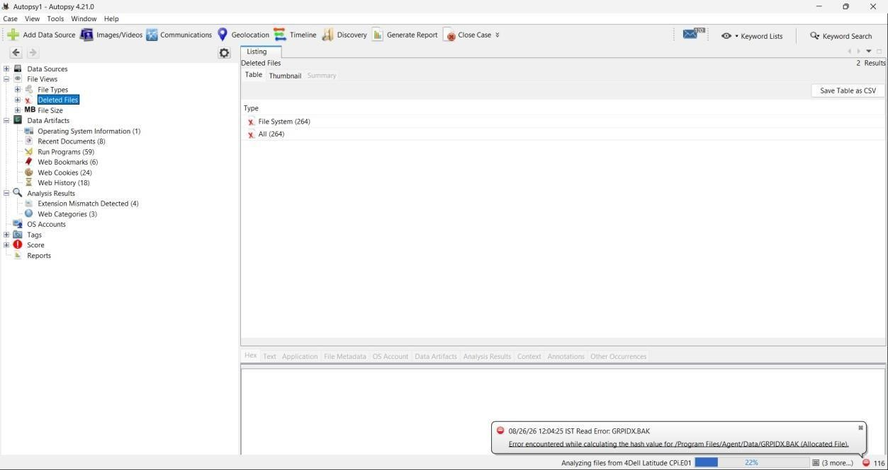

# Experiment 05: Forensic Case Management, Ingest Processing & Evidence Analysis Using Autopsy

---

## 📌 Navigation
[⬅️ Experiment 04: Mail Header Analysis](../Experiment-4/README.md) | [🏠 Master Syllabus](../README.md) | [Experiment 06: The Sleuth Kit ➡️](../Experiment-6/README.md)

---

## 🎯 1. Aim
To utilize the **Autopsy Digital Forensics Platform** to:
1. Create and manage a standardized digital forensic case.
2. Import forensic disk images (`.E01` Expert Witness Format).
3. Configure automated Ingest Modules (Hash Lookup, Keyword Search, Recent Activity, File Type Identification).
4. Analyze recovered artifacts, web activity, and deleted files, culminating in a structured forensic report.

---

## 🛠️ 2. Software & Evidence Required
| Component | Specification / Source | Purpose |
| :--- | :--- | :--- |
| **Autopsy** | v4.x (Open Source Forensic Suite) | Core digital forensics case platform |
| **Evidence Disk Images** | `4Dell Latitude CPi.E01`, `4Dell Latitude CPi.E02` | Split EnCase forensic disk image of target workstation |
| **Evidence Download Link** | [Google Drive Forensic Evidence Repository](https://drive.google.com/drive/u/1/folders/1ilSFY7Tqn2L7AjQGhq8yJ8kixc_xTU-v) | Evidence source data files |

---

## 📖 3. Theoretical Background & Key Concepts

### 3.1 Autopsy Architecture
Autopsy is an extensible, open-source graphical digital forensics interface built upon **The Sleuth Kit (TSK)**. It indexes and parses file systems, unallocated clusters, operating system registries, and web browser histories into a centralized **SQLite** / PostgreSQL database.

### 3.2 Ingest Modules
During evidence ingestion, Autopsy runs modular analysis pipelines in parallel:
- **Recent Activity:** Extracts browser history (Chrome, Firefox, Edge), cookies, bookmarks, operating system MRU (Most Recently Used) lists, and shellbags.
- **Hash Lookup:** Computes MD5/SHA-256 hashes of all files and matches them against the NIST NSRL (National Software Reference Library) to exclude known benign system files (de-Nirving) or flag known malicious files.
- **File Type Identification:** Examines file magic bytes/headers rather than relying on superficial file extensions.
- **Keyword Search:** Indexes all allocated and unallocated text using Apache Solr for rapid full-text searching.

---

## 🔬 4. Step-by-Step Procedure

### Step 1: Starting a New Case
1. Launch **Autopsy**.
2. Click **Create New Case** on the welcome dialog.
3. Configure **Case Information**:
   - **Case Name:** `Dell_Latitude_Investigation`
   - **Base Directory:** `C:\Forensics\Cases`
   - **Case Type:** Single-user

*Figure 5.1: Initializing a new forensic case in Autopsy.*

4. Provide **Optional Information**:
   - **Case Number:** `KARE-DF-2024-EX05`
   - **Examiner Name:** Lead Forensic Analyst
   - **Examiner Phone / Email / Notes:** Chain-of-custody logging

*Figure 5.2: Specifying examiner credentials and case tracking numbers.*

---

### Step 2: Adding Evidence Data Source
1. In the *Add Data Source* wizard, select **Disk Image or VM File**.
2. Click **Browse** and locate the evidence image file: `4Dell Latitude CPi.E01` (Autopsy automatically identifies and links subsequent split segments such as `.E02`).
3. Set Time Zone according to incident location (e.g., UTC / Local).

*Figure 5.3: Adding split .E01 forensic image as evidence data source.*

---

### Step 3: Configuring Ingest Modules
1. On the **Configure Ingest Modules** screen, enable target modules:
   - ✅ Recent Activity
   - ✅ File Type Identification
   - ✅ Hash Lookup
   - ✅ Keyword Search (Email Addresses, IP Addresses, URLs)
   - ✅ Extension Mismatch Detector
2. Click **Next** to begin automated background analysis.

*Figure 5.4: Selecting analysis pipelines and ingest modules.*

---

### Step 4: Indexing & Data Source Registration
1. Autopsy parses the partition structures, mounts the file system, and adds the evidence records to the local case database.
2. Ingest progress is displayed in real time in the bottom-right status bar.

*Figure 5.5: Ingest pipeline indexing file records into local SQLite database.*

*Figure 5.6: Data source successfully populated into the case navigation tree.*

---

### Step 5: Artifact Exploration & Web History Analysis
1. In the left-hand Tree Viewer pane, expand **Data Artifacts**:
   - **Web History / Downloads / Bookmarks:** Reconstruct user internet activities.
   - **Operating System Artifacts:** User accounts, recent documents, USB device connections.
2. Under **File Types**, view documents, multimedia, executables, and deleted items.

*Figure 5.7: Detailed examination of web artifacts and recent activity.*

*Figure 5.8: Traversal of partition file hierarchy and deleted cluster flags.*

---

### Step 6: Generating the Forensic Report
1. Click **Generate Report** from the main toolbar.
2. Select **HTML Report** (or Excel / CSV).
3. Choose specific data artifacts and modules to summarize.
4. Export and review the generated report in a browser.

*Figure 5.9: Final report compilation and evidence summary.*

---

## 📊 5. Observations & Forensic Findings
1. **Multi-Segment Image Handling:** Autopsy seamlessly reassembled split EnCase segments (`.E01` and `.E02`), maintaining file system continuity.
2. **Automated Triage:** Ingest modules successfully surfaced browser searches, downloaded artifacts, and user accounts without requiring manual sector carving.
3. **Audit Trail:** All analyst interactions, searches, and bookmarks were logged into the case database to ensure compliance with legal evidence handling standards.

---

## 🏆 6. Result
A new digital forensics case was successfully established in **Autopsy**. The provided multi-segment `.E01` disk image evidence was imported, processed via automated ingest modules, analyzed for user activity and file artifacts, and comprehensively documented in an HTML forensic report.
