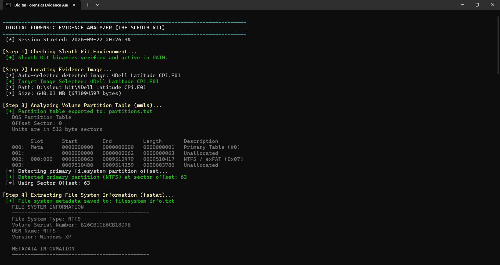
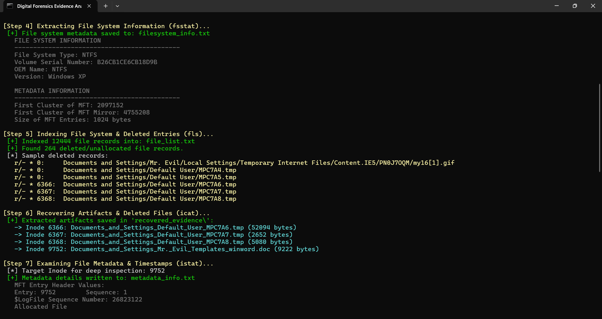
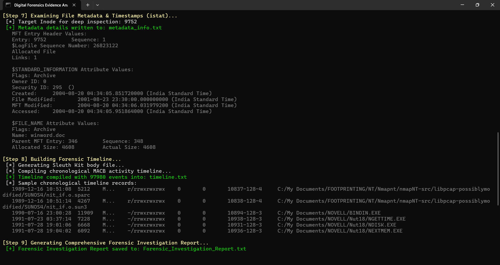
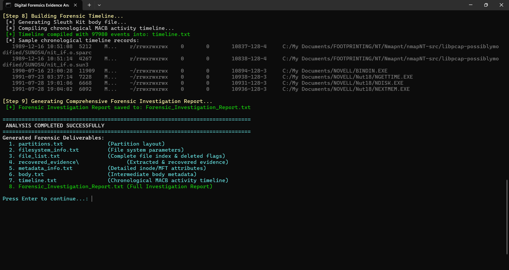

# Experiment 06: File System Analysis, Inode Metadata Extraction & Timeline Generation Using The Sleuth Kit (TSK)

[](#)
[](#)
[](#)

---

## 📌 Navigation
[⬅️ Experiment 05: Autopsy Case Management](../Experiment-5/README.md) | [🏠 Master Syllabus](../README.md) | [Experiment 07: AFLogical Android Extraction ➡️](../Experiment-7/README.md)

---

## 🎯 1. Aim
To conduct a low-level forensic analysis of a disk image, extract file system metadata, recover deleted files using inode references, and generate a chronological file activity timeline using **The Sleuth Kit (TSK)** command-line utilities.

---

## 🛠️ 2. Software & Evidence Required
| Component | Specification / Source | Purpose | Platform |
| :--- | :--- | :--- | :--- |
| **The Sleuth Kit (TSK)** | v4.x CLI Suite | File system analysis, metadata extraction, timeline generation | Windows / Linux |
| **OSFMount** | v3.x Disk Mounting Tool | Mounting raw/E01 images as virtual drives (optional) | Windows |
| **Evidence Disk Images** | `4Dell Latitude CPi.E01`, `4Dell Latitude CPi.E02` | Split EnCase forensic disk images | [Evidence Drive Link](https://drive.google.com/drive/u/1/folders/1ilSFY7Tqn2L7AjQGhq8yJ8kixc_xTU-v) |

---

## 📖 3. Theoretical Background & Key Concepts

### 3.1 The Sleuth Kit (TSK) Architecture
The Sleuth Kit organizes file system analysis into distinct abstraction layers:
1. **Media Layer (`mmls`):** Analyzes volume and partition layouts (DOS, GPT, Sun, BSD).
2. **File System Layer (`fsstat`):** Displays file system metadata (block size, cluster count, allocation bitmaps).
3. **Data Layer (`blkcat`, `blkstat`):** Inspects raw data clusters/blocks.
4. **Metadata Layer (`istat`, `icat`):** Interfaces directly with Inodes (ext) or MFT records (NTFS).
5. **File Name Layer (`fls`):** Traverses directory hierarchies and correlates file names to metadata inodes.

### 3.2 Timeline Analysis (MAC Times)
TSK extracts **MACB** timestamps:
- **M (Modified):** File content alteration.
- **A (Accessed):** File read or executed.
- **C (Changed / MFT Modified):** Metadata or permissions updated.
- **B (Birth / Created):** Initial file creation time on the volume.
By compiling these into a "body" file and passing them through `mactime`, investigators reconstruct second-by-second activity timelines surrounding a security breach.

---

## 🔬 4. Step-by-Step Procedure

### Step 1: Environment Setup & Volume Partition Mapping (`mmls`)
1. Open the Command Prompt and navigate to the TSK installation directory.
2. Run `mmls` to inspect the partition layout and determine sector offsets:
```cmd
mmls "4Dell Latitude CPi.E01"
```
3. Identify the target NTFS partition starting sector (e.g., **Offset: 63**).


*Figure 6.1: Initializing TSK CLI and executing mmls to discover volume layout.*

---

### Step 2: File System Metadata Extraction (`fsstat`)
1. Extract detailed file system architecture information using `fsstat`:
```cmd
fsstat -o 63 "4Dell Latitude CPi.E01" > filesystem_info.txt
```
2. Inspect `filesystem_info.txt` to verify cluster size, volume serial number, and MFT start cluster.


*Figure 6.2: Inspecting file system layout and partition parameters.*

---

### Step 3: Directory Traversal & Deleted File Identification (`fls`)
1. Execute `fls` to recursively list all allocated and deleted entries across the file system:
```cmd
fls -o 63 -r -p "4Dell Latitude CPi.E01" > file_list.txt
```
*Note:* In TSK output, entries prefixed with `*` represent **deleted files**, followed by their metadata address (inode / MFT index).
2. Locate the deleted evidence target file:
```text
* r/r 2084-128-3: wizdata.dat
```


*Figure 6.3: Recursive file system indexing displaying deleted entries marked with asterisks.*

---

### Step 4: Metadata Attribute Examination (`istat`)
1. Inspect the metadata structure of the identified deleted file (Inode `2084`):
```cmd
istat -o 63 "4Dell Latitude CPi.E01" 2084 > metadata_info.txt
```
2. Review file attributes: allocation status (unallocated), sector runs, file size, and MACB timestamps.


*Figure 6.4: Examining inode 2084 timestamps, allocation flags, and runlists.*

---

### Step 5: Deleted File Carving & Recovery (`icat`)
1. Extract the raw data blocks belonging to inode `2084` using `icat`:
```cmd
icat -o 63 "4Dell Latitude CPi.E01" 2084 > wizdata.dat
```
2. Verify the recovered file's contents and compute its SHA-256 hash to preserve evidence integrity.

---

### Step 6: Forensic Timeline Generation (`mactime`)
1. Generate an intermediate body file containing all file system timestamps:
```cmd
fls -m / -o 63 -r "4Dell Latitude CPi.E01" > body.txt
```
2. Process the body file through `mactime` to generate a human-readable chronological event log:
```cmd
mactime -b body.txt -d > timeline.txt
```
3. Open `timeline.txt` to analyze system events preceding and following the incident.


*Figure 6.5: Generated forensic reports, recovered file verification, and timeline artifacts.*

---

## 📊 5. Observations & Forensic Findings
| Operation / Metric | Command | Result / Artifact |
| :--- | :--- | :--- |
| **Partition Sector Offset** | `mmls` | Sector 63 (NTFS File System) |
| **Target Inode** | `fls -r -p` | Inode `2084` (`wizdata.dat`, Deleted) |
| **Allocation State** | `istat` | Unallocated MFT record with preserved runlists |
| **Recovered Artifact** | `icat` | `wizdata.dat` carved and restored |
| **Timeline Reconstruction** | `mactime` | Granular chronological activity log produced |

---

## 🏆 6. Result
Digital evidence was successfully analyzed using **The Sleuth Kit (TSK)** command-line utilities. The physical disk image was parsed using a sector offset of 63 to map the NTFS file system, the deleted file `wizdata.dat` was successfully recovered using its inode address, and a comprehensive timeline of historical file activity was generated for forensic reporting.
