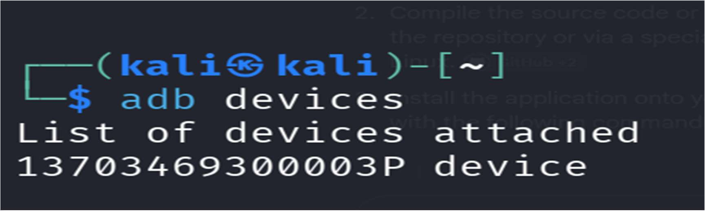
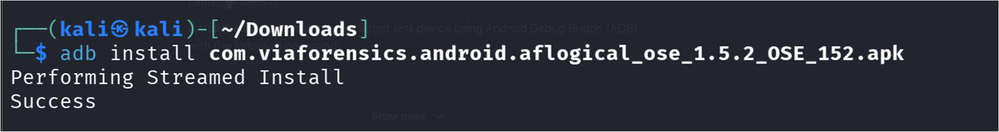
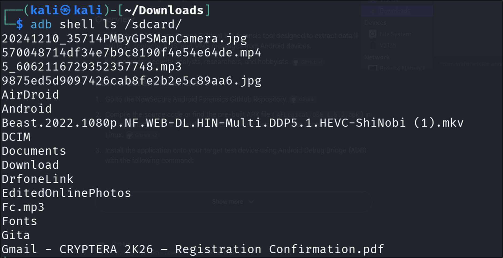
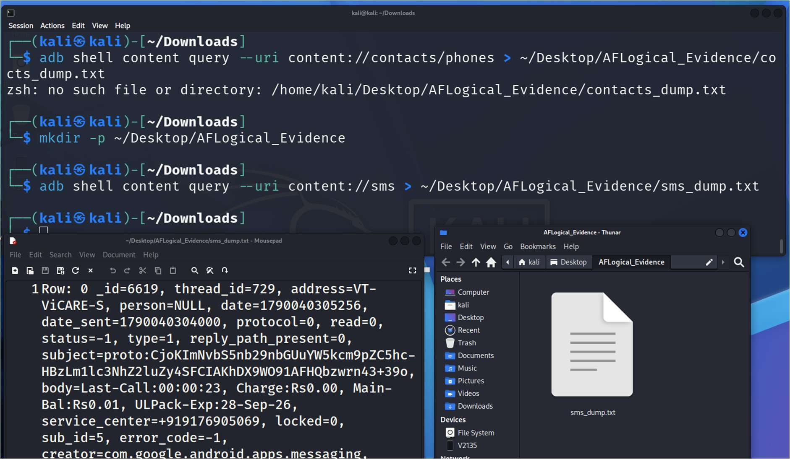

# Experiment 07: Logical Data Extraction from an Android Device Using AFLogical OSE & ADB

[](#)
[](#)
[](#)

---

## 📌 Navigation
[⬅️ Experiment 06: The Sleuth Kit](../Experiment-6/README.md) | [🏠 Master Syllabus](../README.md) | [Experiment 08: Steganography StegExpose ➡️](../Experiment-8/README.md)

---

## 🎯 1. Aim
To configure an Android mobile forensics environment, establish a secure Android Debug Bridge (ADB) connection, deploy the **AFLogical OSE** forensic extraction tool, execute a non-invasive logical acquisition of device databases, and retrieve, verify, and document the resulting CSV artifacts.

---

## 🛠️ 2. Software & Tools Required
| Component | Specification | Purpose |
| :--- | :--- | :--- |
| **Operating System** | Windows / Linux / macOS | Forensic host workstation |
| **Forensic Tool** | AFLogical OSE (Open Source Edition) APK | Mobile application querying internal Content Providers |
| **Bridge Utility** | Android Debug Bridge (ADB) CLI | Interfacing with device subsystem over USB |
| **Runtime Environment**| Java Development Kit (JDK) | Required for SDK utilities |
| **Hardware** | Target Android Device & Data Cable | Physical evidence item |

---

## 📖 3. Theoretical Background & Key Concepts

### 3.1 Logical vs. Physical Mobile Extraction
- **Physical Extraction:** Bit-by-bit raw flash memory image (e.g., via JTAG, chip-off, or root bootloader exploit). Captures deleted database records, unallocated space, and swap memory.
- **Logical Extraction:** Interacts with the operating system's active Application Programming Interfaces (APIs) and **Content Providers**. It extracts currently allocated records without altering system partitions or requiring root privileges.

### 3.2 AFLogical OSE Architecture
AFLogical OSE (developed by viaForensics / NowSecure) is pushed to the target device via ADB. When launched, it queries Android's `android.provider` databases for:
- Contacts (`content://contacts/phones`)
- Call Logs (`content://call_log/calls`)
- SMS / MMS Messages (`content://sms`, `content://mms`)
Extracted records are formatted into standardized, tamper-evident Comma-Separated Values (`.csv`) files on the device storage (`/sdcard/aflogical/`) ready for forensic retrieval.

---

## 🔬 4. Step-by-Step Procedure

### Step 1: Environment Setup & Device Preparation
1. Install the Android SDK Platform-Tools (ADB) on the host workstation and configure the system `PATH`.
2. On the target Android device:
   - Navigate to `Settings > About Phone`.
   - Tap **Build Number** seven times to enable **Developer Options**.
   - Navigate to `Settings > Developer Options` and enable **USB Debugging**.

---

### Step 2: Connecting and Verifying the Device via ADB
1. Connect the target device to the forensic workstation via a certified USB cable.
2. In the terminal, verify connectivity and authorization:
```bash
adb devices
```
3. Confirm the device status changes from `unauthorized` to `device` upon accepting the USB debugging prompt on the phone screen.


*Figure 1: Terminal output displaying the successfully connected and authorized Android device via ADB.*

---

### Step 3: Deploying and Executing AFLogical OSE
1. Install the `aflogical.apk` package onto the target device:
```bash
adb install aflogical.apk
```


*Figure 2: Terminal displaying successful installation of the AFLogical OSE package.*

2. Launch the **AFLogical OSE** application on the Android device.
3. Select the evidence categories to extract:
   - ✅ Contacts
   - ✅ Calls
   - ✅ SMS
   - ✅ MMS
4. Tap **Capture** to extract data into `/sdcard/aflogical/`.


*Figure 3: AFLogical OSE mobile interface displaying data category selection and extraction.*

---

### Step 4: Evidence Transfer, Verification and Analysis
1. Pull the extracted forensic CSV directory from the device storage to the host workstation:
```bash
adb pull /sdcard/aflogical C:\DF\AFLogical_Evidence\
```
2. Open and inspect the generated CSV files (`contacts.csv`, `calls.csv`, `sms.csv`) using spreadsheet software or text editors.
3. Verify timestamps, sender/receiver telephone numbers, message contents, and call durations.


*Figure 4: Reviewing extracted SMS, contacts, and call history records in tabular format.*

---

### Step 5: Forensic Remediation & Hygiene
1. Uninstall the forensic extraction APK from the device to restore baseline operational status:
```bash
adb uninstall com.viaforensics.android.aflogical
```
2. Safely disconnect the device from the workstation.

---

## 📊 5. Observations & Forensic Findings
- **Bridge Authorization:** ADB initialized a secure communication channel, enabling non-destructive command execution without device rooting.
- **Timestamp Standardization:** Timestamps in extracted SMS and call logs were evaluated in Unix Epoch time (milliseconds elapsed since January 1, 1970 UTC), ensuring temporal precision.
- **Data Integrity:** Generated CSV files retained exact phone numbers, international country codes, and SMS transmission bodies.

---

## 📝 6. Academic Assessment Rubrics
| Criteria & Marks Assigned | Mark Allotted | Mark Awarded |
| :--- | :---: | :---: |
| 1. GitHub Activity & Submission Regularity | 3 | -- |
| 2. Application of Forensic Tools & Practical Execution | 3 | -- |
| 3. Documentation & Reporting | 2 | -- |
| 4. Engagement, Problem-Solving & Team Collaboration | 2 | -- |
| **Total** | **10** | -- |

---

## 🏆 7. Result
Logical data extraction from the Android mobile device was successfully executed using **AFLogical OSE** and **ADB**. Critical user artifacts—including contacts, call logs, and SMS messages—were extracted, securely transferred to the forensic workstation, and verified for investigative reporting.
