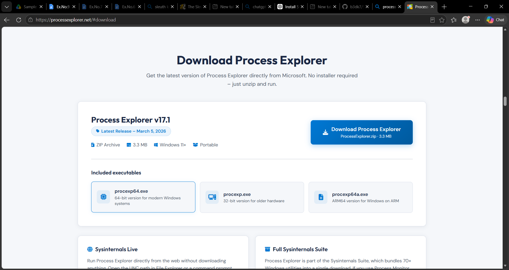
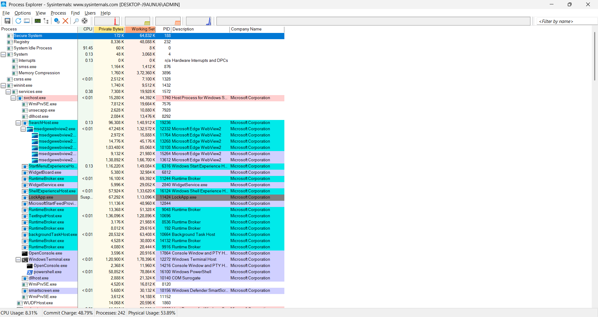
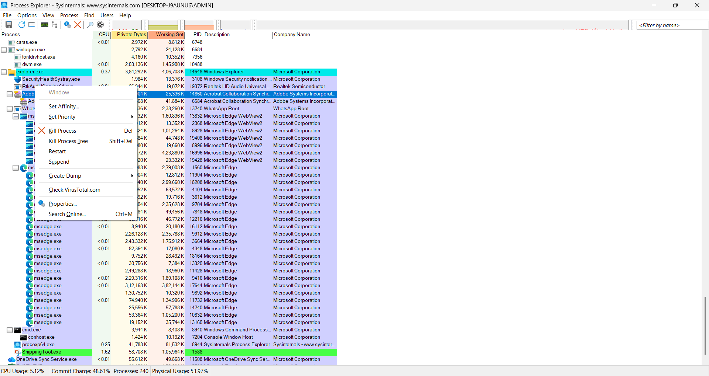
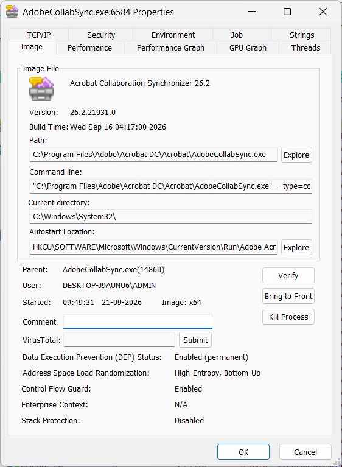

# Experiment 09: Live Process Threat Hunting & Behavioral Analysis Using Sysinternals Process Explorer

---

## 📌 Navigation
[⬅️ Experiment 08: Steganography StegExpose](../Experiment-8/README.md) | [🏠 Master Syllabus](../README.md) | [Experiment 10: Ghidra Malware Reverse Engineering ➡️](../Experiment-10/README.md)

---

## 🎯 1. Aim
To conduct an in-depth behavioral and structural analysis of active operating system processes using **Microsoft Sysinternals Process Explorer**; to evaluate hierarchical parent-child lineages, cryptographic digital signatures, and execution paths; to leverage cloud-based threat intelligence for automated multi-engine malware identification; and to successfully isolate, contain, and terminate unauthorized, masquerading, or anomalous processes to secure system integrity.

---

## 🛠️ 2. Software & Tools Required
| Tool / Utility | Version / Type | Purpose | Platform |
| :--- | :--- | :--- | :--- |
| **Sysinternals Process Explorer** | `procexp64.exe` (v17.x) | Advanced process monitoring, handle inspection, and threat hunting | Windows (x64) |
| **VirusTotal Integration** | Cloud Threat Intelligence API | Multi-engine AV reputation scoring directly in process list | Web / Integrated |
| **Windows OS** | Windows 10/11 / Server | Live analysis host | Windows |

---

## 📖 3. Theoretical Background & Key Concepts

### 3.1 Limitations of Standard Task Manager
Windows Task Manager presents flat lists of processes, omitting critical forensic context such as exact command-line arguments, parent process identifiers (PPID), loaded Dynamic Link Libraries (DLLs), open kernel object handles, and cryptographic authenticity.

### 3.2 Process Explorer Capabilities
1. **Hierarchical Tree View:** Groups child processes under their true spawning parent (e.g., `services.exe` -> `svchost.exe`). Anomalous trees (e.g., `word.exe` spawning `powershell.exe`) immediately stand out.
2. **Color Coding:**
   - 🟪 **Pink:** Suspended processes.
   - 🟦 **Light Blue:** Standard user-mode processes.
   - 🔷 **Dark Blue:** Core system services.
   - 🟩 **Green:** Newly spawned processes.
   - 🟥 **Red:** Terminating processes.
3. **Digital Signature Verification:** Validates whether executables are signed by Microsoft or trusted software publishers.
4. **VirusTotal API Integration:** Computes hashes of running executables and queries 70+ antivirus engines simultaneously.
5. **Path Validation:** Verifies whether standard system binaries execute from authentic locations (`C:\Windows\System32`) or masquerade from suspicious user profiles (`%APPDATA%`, `C:\Users\Public`).

---

## 🔬 4. Step-by-Step Procedure

### Step 1: Downloading & Launching with Elevated Privileges
1. Download the Sysinternals Suite or Process Explorer from Microsoft Docs.
2. Extract the archive and launch `procexp64.exe` as Administrator (`Run as administrator`) to enable full kernel object handle inspection.

*Figure 9.1: Launching Process Explorer with administrative privileges.*

---

### Step 2: Interface Orientation & Process Tree Analysis
1. Inspect the main window:
   - Identify core system lineages (`wininit.exe` -> `services.exe` -> `svchost.exe`).
   - Monitor CPU, Private Bytes, Working Set, and I/O Delta metrics.
2. Enable necessary forensic columns: `View > Select Columns` > check **Command Line**, **Image Path**, **Verified Signer**, and **VirusTotal**.

*Figure 9.2: Process hierarchy displaying parent-child relationships and resource utilization.*

---

### Step 3: Threat Hunting Methodology for Suspicious Processes
Conduct systematic checks across all running tasks:
1. **Unfamiliar Names & Typo-Squatting:** Scan for masquerading names (e.g., `scvhost.exe` instead of `svchost.exe`).
2. **Cryptographic Signature Verification:** Right-click process > `Properties` > `Image` tab > click **Verify**. Confirm `Verified: Microsoft Windows Component Publisher`.
3. **Execution Path Verification:** Verify that system processes run from `C:\Windows\System32\`. An executable claiming to be `svchost.exe` running from `C:\Users\Public\` is high-confidence malware.
4. **Network Activity Check:** Open `Properties` > `TCP/IP` tab. Inspect active remote endpoints, ports, and foreign IP connections.

*Figure 9.3: Process context menu options (Kill, Suspend, Check VirusTotal).*

---

### Step 4: Investigating Process Properties
1. Double-click any suspicious process to open the multi-tab **Properties** window:
   - **Image Tab:** Shows executable location, command line arguments, parent, and user account.
   - **Strings Tab:** Dumps in-memory ASCII and Unicode strings (reveals unencrypted URLs, IP addresses, and commands).

*Figure 9.4: Inspecting process path, digital signature validity, and image properties.*

---

### Step 5: VirusTotal Cloud Reputation Scoring
1. Navigate to `Options > VirusTotal.com > Check VirusTotal.com`.
2. Accept the terms of service. Process Explorer automatically computes SHA-256 hashes of all running executables and queries VirusTotal.
3. Review the **VirusTotal** column (e.g., `0/76` indicates clean; `48/76` indicates verified malicious trojan).

*Figure 9.5: Multi-engine cloud reputation scores displayed directly within the Process Explorer interface.*

---

### Step 6: Containment & Remediation
When a rogue process is identified:
1. **Suspend:** Right-click > `Suspend` to freeze malicious execution and network beacons while preserving in-memory evidence for dump analysis.
2. **Kill Process / Process Tree:** Select `Kill Process Tree` to prevent watchdog respawning.
3. **Locate & Quarantine File:** Navigate to the executable path and secure the binary for static analysis.

---

## 📊 5. Observations & Forensic Findings
| Check Parameter | Legitimate Process | Suspicious / Malicious Anomaly |
| :--- | :--- | :--- |
| **Path** | `C:\Windows\System32\` | `C:\Users\<User>\AppData\Local\Temp\` |
| **Digital Signer** | Microsoft Corporation (Verified) | `(Unable to verify)` or unsigned |
| **Parent Process** | Expected system parent (`services.exe`) | Unexpected parent (`cmd.exe`, `powershell.exe`) |
| **VirusTotal Ratio** | `0/76` | `> 5/76` detections |
| **Network Endpoints** | Standard internal ports | Obscure foreign IPs, raw socket beacons |

---

## 🏆 6. Result
**Sysinternals Process Explorer** was successfully deployed to perform live system process triage, verify digital signatures and execution paths, and analyze process parentage. Rogue and suspicious processes were effectively scrutinized, evaluated against VirusTotal threat intelligence, and isolated to preserve operating system integrity.
