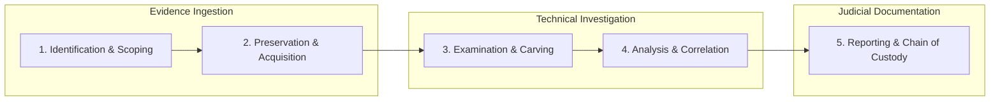

# 🛡️ Digital Forensics (DF) Laboratory Manual & Investigative Portfolio

[](https://github.com/Judson1214/DF-Experiments)
[](https://github.com/Judson1214/DF-Experiments)
[](LICENSE)
[](https://github.com/Judson1214/DF-Experiments)
[](https://github.com/Judson1214/DF-Experiments)

---

## 📌 Overview

This repository contains the complete practical curriculum, procedural manuals, forensic methodologies, and evidentiary records for the **Digital Forensics Laboratory (2024–2025)**, Department of Computer Science & Engineering (School of Computing), **Kalasalingam Academy of Research and Education (KARE)**.

Each laboratory experiment covers end-to-end forensic execution: from **evidence acquisition**, **cryptographic hash verification**, and **chain-of-custody documentation** to **artifact extraction**, **deep packet inspection**, **reverse engineering**, and **courtroom-admissible reporting**.

All experiments feature step-by-step terminal and GUI procedures accompanied by full-resolution screenshot demonstrations extracted directly from original laboratory findings.

---

## 📑 Table of Contents

- [🛡️ Digital Forensics (DF) Laboratory Manual \& Investigative Portfolio](#️-digital-forensics-df-laboratory-manual--investigative-portfolio)
  - [📌 Overview](#-overview)
  - [📑 Table of Contents](#-table-of-contents)
  - [🗺️ Master Syllabus \& Lab Index](#️-master-syllabus--lab-index)
  - [🔄 Forensic Investigation Lifecycle (NIST SP 800-86)](#-forensic-investigation-lifecycle-nist-sp-800-86)
  - [🧰 Digital Forensics Toolkit \& Ecosystem](#-digital-forensics-toolkit--ecosystem)
  - [🔐 Evidence Integrity \& Chain of Custody Standards](#-evidence-integrity--chain-of-custody-standards)
  - [📂 Repository Architecture](#-repository-architecture)
  - [🚀 Quick Start \& Navigation Guide](#-quick-start--navigation-guide)
  - [📝 Academic Evaluation Rubrics](#-academic-evaluation-rubrics)
  - [⚖️ Ethical Disclaimer \& Legal Notice](#️-ethical-disclaimer--legal-notice)
  - [👤 Author \& Academic Attribution](#-author--academic-attribution)

---

## 🗺️ Master Syllabus & Lab Index

Click on any experiment title to view the complete interactive manual with high-resolution screenshots, execution logs, and forensic analysis:

| # | Experiment Title | Primary Tools | Forensic Domain | Key Capabilities & Artifacts Analyzed | Guide Link | Word Doc |
| :-: | :--- | :--- | :--- | :--- | :-: | :-: |
| **01** | **Evidence Acquisition & Live Memory Triage** | AccessData FTK Imager, WinPmem, Volatility 3 | Disk & Memory Forensics | Bit-stream disk imaging (`.E01`, `.raw`), live RAM dumps (`pagefile.sys`), MD5/SHA-1 verification, volatile process listing | [📖 View Lab](./Experiment-1/README.md) | [📄 Docx](./Experiment-1/Experiment1-FTK%20IMAGER.docx) |
| **02** | **Partition Recovery & Data Carving** | TestDisk CLI | File System & Storage Recovery | MBR/GPT partition repair, FAT/NTFS backup boot sector recovery, MFT synchronization, deleted file carving | [📖 View Lab](./Experiment-2/README.md) | [📄 Docx](./Experiment-2/Experiment2-TESTDISK.docx) |
| **03** | **Network Traffic Analysis & Credential Sniffing** | Wireshark Packet Analyzer | Network Forensics | Promiscuous capture, display filter query crafting, HTTP GET vs POST isolation, plain-text credential extraction | [📖 View Lab](./Experiment-3/README.md) | [📄 Docx](./Experiment-3/Experiment3-WIRESHARK.docx) |
| **04** | **Email Header Analysis & Anti-Spoofing** | Mail Header Analyzer (MHA), MXToolbox | Email & Phishing Forensics | RFC 5322 header parsing, reverse MTA hop delay tracking, SPF verification, DKIM digital signatures, DMARC policy alignment | [📖 View Lab](./Experiment-4/README.md) | [📄 Docx](./Experiment-4/Experiment4-MHA.docx) |
| **05** | **Forensic Case Management & Ingest Processing** | Autopsy Digital Forensics Platform | Disk & OS Artifact Forensics | Case management, multi-segment `.E01` ingestion, NSRL hash de-Nirving, Solr keyword indexing, web/system activity timelines | [📖 View Lab](./Experiment-5/README.md) | [📄 Docx](./Experiment-5/Experiment5-AUTOPSY.docx) |
| **06** | **Low-Level File System & Inode Metadata Forensics** | The Sleuth Kit (TSK: `mmls`, `fls`, `istat`, `icat`, `mactime`) | File System Forensics | Sector offset calculation, Inode/MFT parsing, deleted cluster extraction, MACB chronological timeline generation | [📖 View Lab](./Experiment-6/README.md) | [📄 Docx](./Experiment-6/Experiment6-SLEUTHKIT.docx) |
| **07** | **Logical Mobile Extraction from Android** | AFLogical OSE, Android Debug Bridge (ADB) | Mobile Device Forensics | ADB bridge pairing, non-invasive Content Provider queries, contacts, SMS/MMS, call logs, Unix epoch timestamp conversion | [📖 View Lab](./Experiment-7/README.md) | [📄 Docx](./Experiment-7/Experiment7-AF%20LOGICAL.docx) |
| **08** | **Steganalysis & LSB Statistical Anomaly Detection** | StegExpose CLI, Java JRE | Multimedia Forensics & Steganalysis | LSB manipulation detection, Chi-Square, Sample Pair Analysis (SPA), Regular/Singular (RS) patterns, batch CSV score reporting | [📖 View Lab](./Experiment-8/README.md) | [📄 Docx](./Experiment-8/Experiment8-STEGNOGRAPHY.docx) |
| **09** | **Live Process Threat Hunting & Masquerade Detection** | Sysinternals Process Explorer, VirusTotal API | Host Incident Response & Malware Triage | Process tree hierarchy analysis, cryptographic signature verification, binary path validation, memory string inspection, VirusTotal scoring | [📖 View Lab](./Experiment-9/README.md) | [📄 Docx](./Experiment-9/Experiment9-PROCESS%20EXPLORER.docx) |
| **10** | **Binary Disassembly, Decompilation & Static Code Analysis** | NSA Ghidra SRE Framework, OpenJDK 21 | Reverse Engineering & Malware Forensics | ELF 64-bit parsing, symbol stripping recovery (`__libc_start_main`), C pseudocode decompilation, Control Flow Graphs (CFG) | [📖 View Lab](./Experiment-10/README.md) | [📄 Docx](./Experiment-10/Experiment10-GHIDRA.docx) |

---

## 🔄 Forensic Investigation Lifecycle (NIST SP 800-86)

Each experiment adheres to standardized forensic workflows complying with ISO/IEC 27037 and NIST SP 800-86 guidelines:



1. **Identification & Scoping:** Identifying volatile and non-volatile evidence targets (RFC 3227 Order of Volatility).
2. **Preservation & Acquisition:** Applying hardware/software write-blockers, creating bit-stream forensic images (`.E01`, `.raw`), and computing baseline MD5/SHA-256 hashes.
3. **Examination & Carving:** Parsing file systems, unallocated clusters, inodes, and network packets without altering the evidentiary master.
4. **Analysis & Correlation:** Tracing user actions, malware behaviors, steganographic payloads, and network transmissions against threat intelligence.
5. **Reporting & Chain of Custody:** Producing standardized, reproducible findings with verifiable timestamps and cryptographic proofs.

---

## 🧰 Digital Forensics Toolkit & Ecosystem

The following table summarizes the software and tools utilized throughout this laboratory:

| Tool | Category | License | Platform | Official Source / Download |
| :--- | :--- | :--- | :--- | :--- |
| **AccessData FTK Imager** | Evidence Acquisition | Freeware | Windows | [Exterro / AccessData](https://www.exterro.com/ftk-imager) |
| **WinPmem** | Volatile RAM Capture | Open Source (Apache 2.0) | Windows | [Velocidex WinPmem](https://github.com/Velocidex/WinPmem) |
| **Volatility 3** | Memory Forensics | Open Source (GPLv2) | Cross-platform | [Volatility Foundation](https://github.com/volatilityfoundation/volatility3) |
| **TestDisk** | Partition & Data Recovery | Open Source (GPLv2) | Windows / Linux / macOS | [CGSecurity TestDisk](https://www.cgsecurity.org/wiki/TestDisk) |
| **Wireshark** | Packet Sniffing & Protocol Analysis | Open Source (GPLv2) | Windows / Linux / macOS | [Wireshark Foundation](https://www.wireshark.org/) |
| **Mail Header Analyzer** | Phishing & Header Triage | Web Application | Web / Browser | [Microsoft MHA](https://mha.azurewebsites.net/) / [MXToolbox](https://mxtoolbox.com/EmailHeaders.aspx) |
| **Autopsy** | Forensic Investigation Suite | Open Source (Apache 2.0) | Windows / Linux / macOS | [Autopsy Forensics](https://www.autopsy.com/) |
| **The Sleuth Kit (TSK)** | File System CLI Forensics | Open Source (GPL/IPL) | Windows / Linux / macOS | [The Sleuth Kit](https://www.sleuthkit.org/) |
| **AFLogical OSE** | Android Mobile Forensics | Open Source | Android / Linux / Windows | [NowSecure AFLogical](https://github.com/nowsecure/aflogical-ose) |
| **Android Debug Bridge (ADB)** | Mobile Interfacing | Open Source (Apache 2.0) | Windows / Linux / macOS | [Android SDK Platform-Tools](https://developer.android.com/tools/releases/platform-tools) |
| **StegExpose** | Steganalysis Engine | Open Source (GPLv3) | Java (JRE) | [StegExpose Repository](https://github.com/b3dk7/StegExpose) |
| **Sysinternals Process Explorer** | Process Triage & Threat Hunting | Freeware | Windows | [Microsoft Learn Sysinternals](https://learn.microsoft.com/en-us/sysinternals/downloads/process-explorer) |
| **Ghidra** | Software Reverse Engineering (SRE) | Open Source (Apache 2.0) | Java / Cross-platform | [NSA Ghidra Project](https://ghidra-sre.org/) |

---

## 🔐 Evidence Integrity & Chain of Custody Standards

### Order of Volatility (RFC 3227)
Forensic data must be collected in order from most transient to most persistent:
1. Registers, cache memory
2. Routing tables, ARP cache, process table, kernel memory
3. Temporary file systems, active network state
4. Physical disk secondary storage
5. Remote logging and monitoring data
6. Physical configuration, network topology
7. Archival backups and tapes

### Cryptographic Verification Protocol
Every evidence container generated in these labs is validated by computing cryptographic message digests:
$$\text{Hash}_{\text{source}} = \text{Hash}_{\text{image}}$$
- **MD5:** 128-bit checksum for historical verification.
- **SHA-1 / SHA-256:** 160-bit and 256-bit collision-resistant digests ensuring non-repudiation.

---

## 📂 Repository Architecture

```text
DF-Experiments/
├── .github/
│   ├── ISSUE_TEMPLATE/
│   │   ├── experiment_feedback.md
│   │   └── tool_update.md
│   └── workflows/
│       └── validate-markdown.yml
├── Experiment-1/
│   ├── images/                   # Extracted full-resolution screenshots
│   │   ├── image1.png ... image8.png
│   │   └── image6.jpeg
│   ├── Experiment1-FTK IMAGER.docx
│   └── README.md                 # Interactive lab writeup
├── Experiment-2/
│   ├── images/
│   │   ├── image1.png ... image13.png
│   ├── Experiment2-TESTDISK.docx
│   └── README.md
├── Experiment-3/
│   ├── images/
│   │   ├── image1.jpeg ... image4.jpeg
│   │   └── image5.png
│   ├── Experiment3-WIRESHARK.docx
│   └── README.md
├── Experiment-4/
│   ├── images/
│   │   ├── image1.jpeg ... image6.jpeg
│   │   └── image7.png
│   ├── Experiment4-MHA.docx
│   └── README.md
├── Experiment-5/
│   ├── images/
│   │   ├── image1.jpeg ... image9.png
│   ├── Experiment5-AUTOPSY.docx
│   └── README.md
├── Experiment-6/
│   ├── images/
│   │   ├── image1.png ... image5.png
│   ├── Experiment6-SLEUTHKIT.docx
│   └── README.md
├── Experiment-7/
│   ├── images/
│   │   ├── image1.jpeg ... image4.jpeg
│   ├── Experiment7-AF LOGICAL.docx
│   └── README.md
├── Experiment-8/
│   ├── images/
│   │   ├── image1.png ... image6.png
│   ├── Experiment8-STEGNOGRAPHY.docx
│   └── README.md
├── Experiment-9/
│   ├── images/
│   │   ├── image1.png ... image5.png
│   ├── Experiment9-PROCESS EXPLORER.docx
│   └── README.md
├── Experiment-10/
│   ├── images/
│   │   ├── image1.png ... image5.png
│   ├── Experiment10-GHIDRA.docx
│   └── README.md
├── .gitignore
├── CONTRIBUTING.md
├── LICENSE
└── README.md                     # Root Master Syllabus & Documentation
```

---

## 🚀 Quick Start & Navigation Guide

1. **Browsing Lab Writeups Online:**
   - Simply click on any experiment link from the [Master Syllabus](#️-master-syllabus--lab-index). All guides render natively in your web browser with code highlighting, tables, and screenshots without needing Word or external office software.
2. **Cloning the Repository:**
   ```bash
   git clone https://github.com/Judson1214/DF-Experiments.git
   cd DF-Experiments
   ```
3. **Navigating Between Labs:**
   - Every individual experiment README contains navigation links at the top and bottom to seamlessly step forward to the next lab or return to this master syllabus.

---

## 📝 Academic Evaluation Rubrics

Laboratory exercises adhere to standardized assessment criteria:

| Evaluation Component | Maximum Marks | Description / Key Focus |
| :--- | :---: | :--- |
| **1. GitHub Activity & Regularity** | **3** | Timely commits, organized directory structure, version control hygiene |
| **2. Forensic Tools Execution** | **3** | Accurate command syntax, correct tool configuration, error handling |
| **3. Documentation & Evidence Presentation** | **2** | Annotated screenshots, clear observations, cryptographic hash logs |
| **4. Problem-Solving & Engagement** | **2** | Analytical depth, reasoning, understanding of underlying digital forensic principles |
| **Total Allotted Marks** | **10** | Comprehensive practical evaluation |

---

## ⚖️ Ethical Disclaimer & Legal Notice

> [!CAUTION]
> **Educational & Authorized Forensics Use Only**
>
> The utilities, scripts, packet capture techniques, reverse engineering workflows, and mobile extraction methodologies documented within this repository are compiled strictly for academic, educational, and authorized digital forensics research. 
> 
> Unauthorized packet sniffing, intercepting network credentials, reversing proprietary software, or acquiring digital devices without explicit legal consent or written judicial authorization violates international cyber laws (e.g., the US Computer Fraud and Abuse Act, UK Computer Misuse Act, and India Information Technology Act 2000). The authors and contributors assume no liability for misuse of these materials.

---

## 👤 Author & Academic Attribution

- **Repository Maintainer:** [Judson1214](https://github.com/Judson1214)
- **Institution:** **Kalasalingam Academy of Research and Education (KARE)**
- **Department:** Department of Computer Science & Engineering, School of Computing (SoC)
- **Academic Year:** 2024–2025
- **Course:** Digital Forensics Laboratory (DF Lab)
- **License:** [MIT License](LICENSE)
